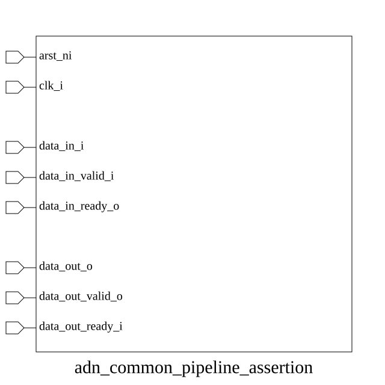

# adn_common_pipeline_assertion (module)

### Author: Foez Ahmed (foez.official@gmail.com)

### Source: adn_common_pipeline_assertion.sv

## Top IO

## Parameters

|Name|Type|Dimension|Default|Description|
|-|-|-|-|-|
|DATA_WIDTH|int||32|Width of the data bus in bits|

## Ports

|Name|Direction|Type|Dimension|Description|
|-|-|-|-|-|
|arst_ni|input|logic||Active-low asynchronous reset, must be stable|
|clk_i|input|logic||System clock, rising-edge triggered|
|data_in_i|input|logic [DATA_WIDTH-1:0]||Data payload from upstream producer|
|data_in_valid_i|input|logic||Valid signal indicating data_in_i is stable|
|data_in_ready_o|input|logic||Ready signal indicating upstream can accept data|
|data_out_o|input|logic [DATA_WIDTH-1:0]||Data payload to downstream consumer|
|data_out_valid_o|input|logic||Valid signal indicating data_out_o is stable|
|data_out_ready_i|input|logic||Ready signal indicating downstream can accept data|

## Description

### Purpose
This module provides a standardized set of assertions for pipeline interfaces. It utilizes `adn_common_valid_ready_checker` to verify that data, valid, and ready signals adhere to standard handshake protocols at both the upstream input and downstream output boundaries of a pipeline stage.

### Use Case
This module is primarily used in digital design verification to ensure that pipeline stages maintain data integrity and handshake protocol compliance. By instantiating this module at the boundaries of a pipeline stage, designers can automatically detect protocol violations—such as data changing while valid is high without a ready signal—thereby reducing debug time and ensuring robust communication between upstream producers and downstream consumers.

| REVISION | DATE       | AUTHOR          | DESCRIPTION                                            |
|----------|------------|-----------------|--------------------------------------------------------|
| 0.1      | 2026-08-09 | Foez Ahmed      | Initial version                                        |
| 1.0      | 2026-08-09 | Foez Ahmed      | Stable release                                         |

Author : Foez Ahmed (foez.official@gmail.com)
