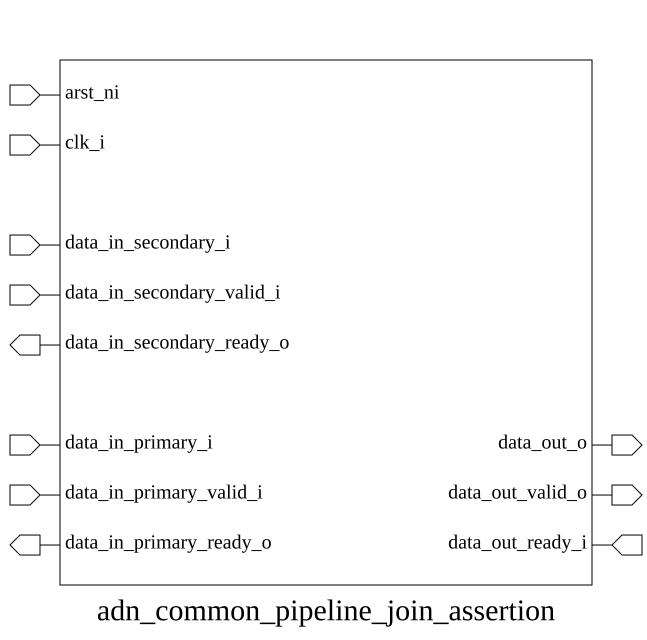

# adn_common_pipeline_join_assertion (module)

### Author: Foez Ahmed (foez.official@gmail.com)

### Source: adn_common_pipeline_join_assertion.sv

## Top IO

## Parameters

|Name|Type|Dimension|Default|Description|
|-|-|-|-|-|
|DATA_WIDTH|int||32|Width of the data bus in bits|

## Ports

|Name|Direction|Type|Dimension|Description|
|-|-|-|-|-|
|arst_ni|input|logic||Active-low asynchronous reset|
|clk_i|input|logic||Rising-edge clock signal|
|clear_i|input|logic||Synchronous clear to flush pipeline|
|data_in_secondary_i|input|logic [DATA_WIDTH-1:0]||Secondary input data bus|
|data_in_secondary_valid_i|input|logic||Secondary input valid signal|
|data_in_secondary_ready_o|output|logic||Secondary input ready signal|
|data_in_primary_i|input|logic [DATA_WIDTH-1:0]||Primary input data bus|
|data_in_primary_valid_i|input|logic||Primary input valid signal|
|data_in_primary_ready_o|output|logic||Primary input ready signal|
|data_out_o|output|logic [DATA_WIDTH-1:0]||Downstream output data bus|
|data_out_valid_o|output|logic||Downstream output valid signal|
|data_out_ready_i|input|logic||Downstream output ready signal|

## Description

### Purpose
This module serves as a verification wrapper that integrates `adn_common_valid_ready_checker` instances across all primary, secondary, and output interfaces. Its primary function is to enforce and monitor handshake protocol compliance (valid/ready) within a pipeline join structure, ensuring data integrity and flow control correctness during simulation.

### Use Case
This module is utilized in pipeline join architectures where multiple upstream data streams (primary and secondary) are merged into a single downstream interface. By instantiating this module, designers can automatically verify that the handshake logic at each interface adheres to the AXI-style valid/ready protocol, preventing common bugs such as data loss, protocol deadlocks, or illegal state transitions during high-speed data movement.

| REVISION | DATE       | AUTHOR          | DESCRIPTION                                            |
|----------|------------|-----------------|--------------------------------------------------------|
| 0.1      | 2026-08-09 | Foez Ahmed | Initial version                                        |
| 1.0      | 2026-08-09 | Foez Ahmed | Stable release                                         |

Author : Foez Ahmed (foez.official@gmail.com)
