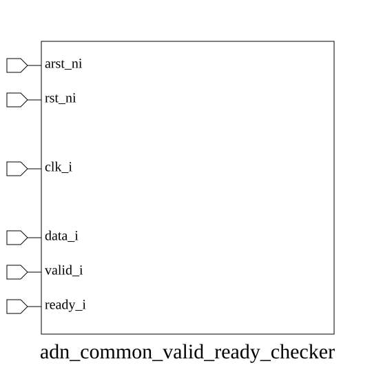

# adn_common_valid_ready_checker (module)

### Author: Foez Ahmed (foez.official@gmail.com)

### Source: adn_common_valid_ready_checker.sv

## Top IO

## Parameters

|Name|Type|Dimension|Default|Description|
|-|-|-|-|-|
|DATA_WIDTH|int||8|Width of the data bus being monitored|
|IGNORE_RULE_0|bit||0|Disable rule 0: Data stability check|
|IGNORE_RULE_1|bit||0|Disable rule 1: Handshake timing check|
|IGNORE_RULE_2|bit||0|Disable rule 2: Sync reset check for VALID|
|IGNORE_RULE_3|bit||0|Disable rule 3: Sync reset check for READY|
|IGNORE_RULE_4|bit||0|Disable rule 4: Async reset check for VALID|
|IGNORE_RULE_5|bit||0|Disable rule 5: Async reset check for READY|
|IGNORE_RULE_6|bit||0|Disable rule 6: Async reset de-assertion check for VALID|
|IGNORE_RULE_7|bit||0|Disable rule 7: Async reset de-assertion check for READY|

## Ports

|Name|Direction|Type|Dimension|Description|
|-|-|-|-|-|
|arst_ni|input|logic||Asynchronous active-low reset|
|rst_ni|input|logic||Synchronous active-low reset|
|clk_i|input|logic||System clock|
|data_i|input|logic [DATA_WIDTH-1:0]||Data payload to monitor for stability|
|valid_i|input|logic||Valid signal from the source|
|ready_i|input|logic||Ready signal from the destination|

## Description

### Purpose
The `adn_common_valid_ready_checker` module serves as a verification component designed to monitor and enforce protocol compliance for AXI-style handshake interfaces. It utilizes SystemVerilog assertions to ensure that data remains stable during stalls, reset signals are handled correctly, and handshake signals adhere to expected timing behaviors.

### Use Case
This module is primarily used in RTL verification environments to act as a passive monitor for AXI-Stream or similar ready/valid handshake interfaces. It is instantiated alongside design modules to:
- Detect protocol violations during simulation without impacting the design's functional logic.
- Ensure data integrity by verifying that the payload remains stable when a transaction is stalled (valid high, ready low).
- Validate reset behavior by ensuring that handshake signals are de-asserted correctly during asynchronous and synchronous reset sequences.
- Provide immediate feedback via assertion errors, significantly reducing debug time for handshake-related bugs.

| REVISION | DATE       | AUTHOR          | DESCRIPTION                                            |
|----------|------------|-----------------|--------------------------------------------------------|
| 0.1      | 2026-08-09 | Foez Ahmed      | Initial version                                        |
| 1.0      | 2026-08-09 | Foez Ahmed      | Stable release                                         |

Author : Foez Ahmed (foez.official@gmail.com)
