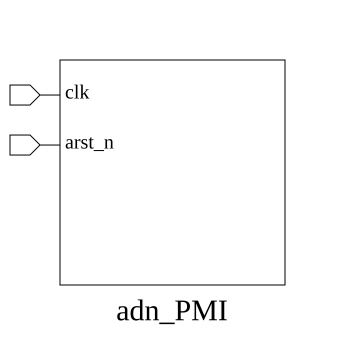

# adn_PMI (interface)

### Author: Shykul Islam Siam (shykulislam32@gmail.com)

### Source: adn_PMI.sv

## Top IO

## Parameters

|Name|Type|Dimension|Default|Description|
|-|-|-|-|-|
|ADDR_WIDTH|int||32||
|DATA_WIDTH|int||32||

## Ports

|Name|Direction|Type|Dimension|Description|
|-|-|-|-|-|
|clk|input|logic|||
|arst_n|input|logic|||

## Description

# Purpose
This file defines the `adn_PMI` interface, a synchronous, pipelined
request/response bus used for master-slave communication in the
ADN-VLSI/adn_common project. It encapsulates the request channel
(address, write-enable, write-data, strobe, valid) and the
grant/response channel (grant, ack, read-data, response status)
between a single master and a single slave.

# Use Case
This file serves as the standard interconnect definition for PMI-based
memory and peripheral access. It is primarily used to:
- Provide a uniform signal bundle for request and response channels,
parameterized by configurable address (`ADDR_WIDTH`) and data
(`DATA_WIDTH`) widths.
- Decouple request and response timing, allowing a request and a
response to transfer independently in the same cycle.
- Expose dedicated `master`, `slave`, and `monitor` modports to
restrict signal directionality based on the connecting agent's role.
- Enable consistent, reusable master-slave connections across RTL and
verification environments in the `ADN-VLSI/adn_common` project.

| REVISION | DATE       | AUTHOR                 | DESCRIPTION                                            |
|----------|------------|------------------------|--------------------------------------------------------|
| 0.1      | 2026-08-04 | Shykul Islam Siam      | Initial version                                        |
| 1.0      | 2026-08-09 | Shykul Islam Siam      | Stable release                                         |

Author : Shykul Islam Siam (shykulislam32@gmail.com)
