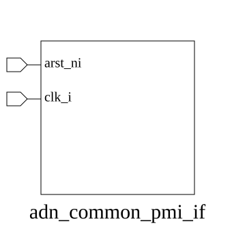

# adn_common_pmi_if (interface)

### Author: Foez Ahmed (foez.official@gmail.com)

### Source: adn_common_pmi_if.sv

## Top IO

## Parameters

|Name|Type|Dimension|Default|Description|
|-|-|-|-|-|
|req_t|type||logic|Request structure type definition|
|rsp_t|type||logic|Response structure type definition|

## Ports

|Name|Direction|Type|Dimension|Description|
|-|-|-|-|-|
|arst_ni|input|logic||Active-low asynchronous reset|
|clk_i|input|logic||System clock input|

## Description

### Purpose
The `adn_common_pmi_if` interface provides a standardized, transaction-level communication protocol for memory-mapped interactions within the ADN-VLSI ecosystem. It abstracts the underlying signal handshaking between masters and slaves, facilitating modular verification and design reuse through parameterized request and response structures.

### Use Case
This interface is primarily used to decouple the physical signal-level implementation of memory-mapped buses from the verification components (like UVM drivers/monitors) and RTL modules. By utilizing `msend`, `mrecv`, `ssend`, and `srecv` tasks, users can perform high-level read/write transactions without manually managing clock-cycle-accurate handshaking signals. It is ideal for:
- **Verification Environments:** Implementing bus functional models (BFMs) that interact with memory-mapped peripherals.
- **System-on-Chip (SoC) Integration:** Connecting IP blocks that require a standardized, lightweight interface for register access or memory-mapped communication.
- **Modular Design:** Allowing RTL designers to swap underlying bus protocols while keeping the transaction-level testbench code unchanged.

| REVISION | DATE       | AUTHOR          | DESCRIPTION                                            |
|----------|------------|-----------------|--------------------------------------------------------|
| 0.1      | 2026-08-13 | Foez Ahmed      | Initial version                                        |
| 1.0      | 2026-08-13 | Foez Ahmed      | Stable release                                         |

Author : Foez Ahmed (foez.official@gmail.com)
