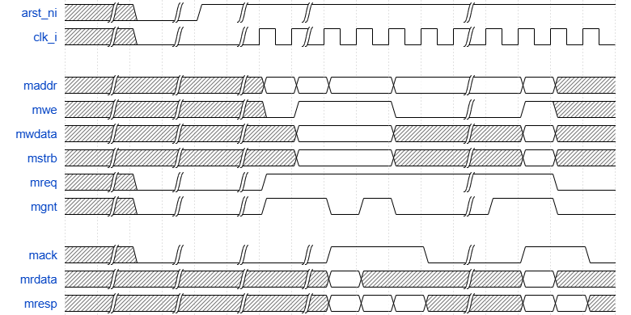
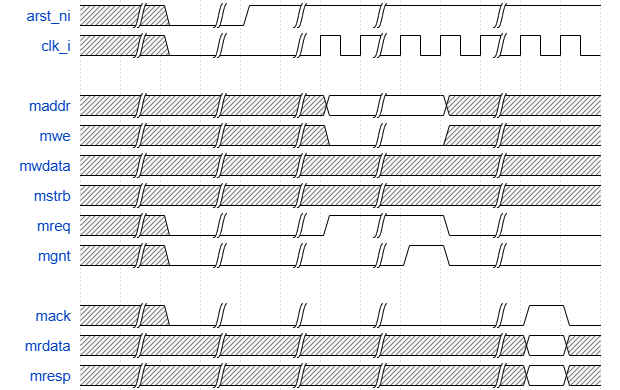
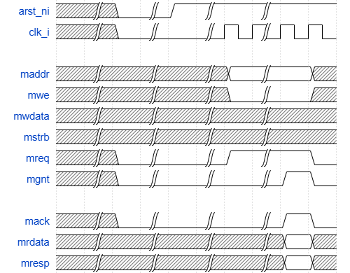
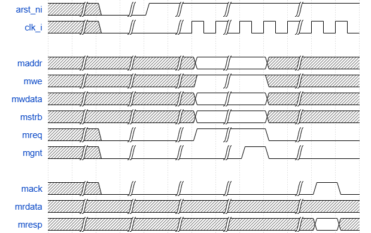
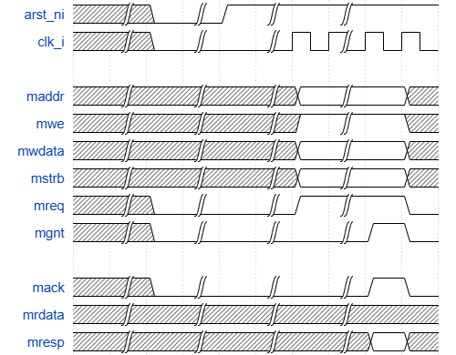

# Pipelined Memory Interface (PMI) Specification

## 1. Introduction

The **Pipelined Memory Interface (PMI)** is a synchronous request/response memory protocol intended for on-chip communication between a single master and a single slave. PMI supports pipelined requests, slave backpressure, multiple outstanding transactions, and strictly ordered responses.

## 2. Interface Signals

| Signal   | Dir    | Width        | Description                       |
| -------- | ------ | ------------ | --------------------------------- |
| `clk`    | Global | 1            | Rising-edge clock                 |
| `arst_n` | Global | 1            | Asynchronous active-low reset     |
| `maddr`  | M→S    | 1--32        | Aligned address                   |
| `mwe`    | M→S    | 1            | Write enable (1=write, 0=read)    |
| `mwdata` | M→S    | 8/16/32/64   | Write data                        |
| `mstrb`  | M→S    | DATA_WIDTH/8 | Byte write strobes                |
| `mreq`   | M→S    | 1            | Request valid                     |
| `mgnt`   | S→M    | 1            | Request grant/ready               |
| `mack`   | S→M    | 1            | Response valid                    |
| `mrdata` | S→M    | DATA_WIDTH   | Read data                         |
| `mresp`  | S→M    | 1            | Response status (0=OKAY, 1=ERROR) |

## 3. Transaction Overview

A request is accepted on the rising edge of `clk` when:

```text
arst_n && mreq && mgnt
```

Accepted requests become **outstanding transactions**.

A transaction completes only when `mack` is asserted.

- Read latency is implementation-defined.
- Write latency is implementation-defined.
- Multiple outstanding requests are supported.
- Responses are returned strictly in-order.
- The request and response channels are independent.

## 4. Protocol Rules

### PR-1 Clocking

All protocol transfers occur on the rising edge of `clk` while
`arst_n` is high.

### PR-2 Reset

During reset (`arst_n=0`): - `mreq` = 0 - `mgnt` = 0 - `mack` = 0

All other signals are don't-care.

### PR-3 Request Validity

The master shall drive valid values for `maddr`, `mwe`, `mwdata`, and
`mstrb` before asserting `mreq`.

### PR-4 Request Acceptance

A request is accepted only when `mreq` and `mgnt` are both high on a
rising clock edge.

### PR-5 Stable Request Rule

While `mreq=1` and `mgnt=0`, the master shall hold `maddr`, `mwe`,
`mwdata`, and `mstrb` stable.

### PR-6 Request Completion

After a successful request handshake, the master may modify all request
signals on the following cycle.

### PR-7 Outstanding Transactions

The protocol supports multiple outstanding transactions. The maximum
number is implementation-defined. A slave shall deassert `mgnt` whenever
it cannot accept more requests.

### PR-8 Continuous Grant

The slave may hold `mgnt` asserted continuously. In that case, the
master may issue one request every clock cycle.

### PR-9 Response Generation

Exactly one `mack` shall be generated for every accepted request.

### PR-10 Ordering

Responses shall be returned in the same order that requests were
accepted.

### PR-11 Independent Channels

A response may occur in the same cycle that another request is accepted.

### PR-12 Read Response

For reads, `mrdata` and `mresp` are valid whenever `mack` is asserted.

### PR-13 Write Response

For writes, `mrdata` is don't-care. `mresp` indicates success or
failure.

### PR-14 Transaction Completion

A transaction completes only when `mack` is asserted.

### PR-15 Response Encoding

    `mresp` Meaning

---

          0 OKAY
          1 ERROR

### PR-16 Byte Strobes

`mstrb` selects active byte lanes. `mstrb==0` is legal and performs no
write.

### PR-17 Address Alignment

`maddr` shall be naturally aligned to the data bus width.

### PR-18 Read Data Validity

`mrdata` is only valid for read responses when `mack` is asserted.

### PR-19 Backpressure

The slave shall throttle requests solely using `mgnt`.

### PR-20 Response Latency

The protocol places no minimum or maximum bound on response latency.

## 5. Recommended Timing Examples

1.  Single-Cycle Write
2.  Write with Backpressure
3.  Single-Cycle Read
4.  Read with Backpressure
5.  Back-to-Back Transactions
6.  Simultaneous Request Acceptance and Response










