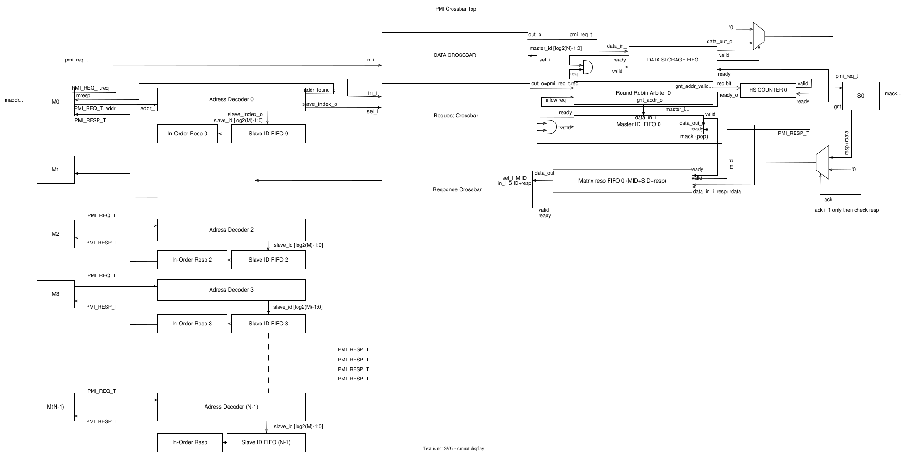

# PMI-to-PMI Crossbar Communication System — Project Documentation

---

## Table of Contents

1. [Theory](#1-theory)
2. [Q&A — Relevant Questions & Solutions](#2-qa--relevant-questions--solutions)
3. [Block Diagram](#3-block-diagram)
4. [Architectural Decisions](#4-architectural-decisions)
5. [Verification](#5-verification)
6. [Project Outcome](#6-project-outcome)
7. [Simulation Commands](#7-simulation-commands)
8. [Contribution Tables](#8-contribution-tables)

---

## 1. Theory

### 1.1 Overview

This project implements a **PMI-to-PMI Crossbar Communication System**, a fabric that connects **M master PMI (Protocol Memory Interface) signals** to **N slave PMI signals**, allowing any master to transact with any slave through a shared, arbitrated interconnect.

The system is split into two independent but coordinated data paths:

- **Forward Path (Request Path):** Master → Address Decoder → Round Robin Arbiter (decides winner) → Request Crossbar (executes the mux) → Slave
- **Backward Path (Response Path):** Slave → Per-(Master, Slave) Response Staging Buffer (routing + hold, in place of a literal second crossbar) → Slave ID FIFO match (comparator-equivalent) → Master

Ordering and routing correctness are maintained end-to-end using two families of tracking FIFOs:

- **Slave ID FIFO** (one per master) — records, in issue order, which slave each outstanding request was routed to.
- **Master ID FIFO** (one per slave) — records, in arbitration-granted order, which master is currently owed a response from that slave.

**RTL implementation note:** The initial architecture assumed the Request Crossbar performs routing *before* the Round Robin Arbiter, and that a symmetrical Response Crossbar mirrors it on the return path. The actual RTL (`adn_common_pmi_nxm_crossbar`) implements this differently for reasons of buildability: a plain crossbar (`adn_common_xbar`) is a stateless, `sel`-driven mux with no memory and no contention logic — it cannot pick a winner among competing masters, and it cannot hold an early/out-of-order response in flight. So the arbiter must decide the winning `master_id` **first** (using a cheap 1-bit-per-master request vector), and that `master_id` is then used as the crossbar's `sel_i` to mux the full-width payload through. On the response side, there is no second `adn_common_xbar` instance at all; instead, a small per-(master, slave) staging buffer (`resp_buffer_data` / `resp_buffer_valid`) holds each slave's response until the requesting master's Slave ID FIFO head matches it — this buffer plays the combined role of the Response Crossbar *and* the comparator described below. The end-to-end behavior (address-routed requests, round-robin fairness per slave, in-order response delivery per master) matches the original intent; only the internal block ordering and the "two separate crossbars" assumption differ.

### 1.2 Forward Path (Request Path) — Detailed Flow

1. **Master Interface (M0 … M(N-1))**
   Each master drives a `PMI_REQ_T` (request) signal and receives a `PMI_RESP_T` (response) signal. Every master is wired into its own **Address Decoder** block.

2. **Address Decoder (per master, M instances)**
   - In the RTL (`adn_common_address_decoder`), the decoder is a **pure address-to-slave_id function** — it takes only `maddr` plus the static `min_addr_i` / `max_addr_i` / `slave_id_i` range tables and outputs `slave_index_o` + `addr_found_o`. There is no separate "wrapper" block; pass-through of the other request fields (`mwe`, `mwdata`, `mstrb`) happens at the top-level module, not inside a per-master decoder wrapper.
   - Internally, the decoder runs `NUM_RULES` parallel range comparators producing a one-hot match vector, then resolves it with a **fixed-priority arbiter** (higher rule index wins). This supports **overlapping address ranges** with priority-based tie-breaking — a capability beyond a simple non-overlapping lookup, and worth confirming as intentional.
   - If no rule matches (`addr_found_o` low), the top module generates an internal decode-error response one cycle later instead of stalling — this default-slave/error path is an addition not present in the original architecture description.
   - The decoded `slave_id` is used to build a per-slave request vector for arbitration, and is pushed into the **Slave ID FIFO** associated with that master **only once the request is actually granted** (not on every request attempt) — this avoids reserving FIFO entries for requests that never win arbitration.

3. **Slave ID FIFO (per master, M instances)**
   - A FIFO that stores the sequence of `slave_id`s in the exact order the master's requests were **granted** (not merely issued).
   - This preserves **request ordering per master**, which is essential since responses may return out of order relative to issue order (multiple slaves, multiple masters, arbitration delays, etc.).
   - Works together with the response-side staging buffer (see §1.3) during the response phase.
   - Push is gated by `data_in_ready_o` (backpressure): a request cannot be accepted into arbitration until there is space in this FIFO.

4. **Round Robin Arbiter (per slave, N instances)**
   - Since multiple masters can target the same slave simultaneously, each slave has its own arbiter to resolve contention.
   - The arbiter operates on a lightweight one-hot **request vector** (not the full request payload) and selects one winning master per grant cycle using genuine round-robin rotation (a rotating crossbar re-orders requests relative to the last winner before a fixed-priority encoder picks the next one) — this guarantees fairness/no starvation across masters.
   - The winning `master_id [log2(N)-1:0]` is pushed into the **Master ID FIFO** directly beneath that arbiter, and is also used as the **selection signal for the Request Crossbar** (see step 5) — arbitration is resolved *before* the payload is routed, since a stateless mux has no way to pick a winner on its own.

5. **Request Crossbar**
   - A purely combinational, `sel`-driven mux (`adn_common_xbar`): for each slave output, it selects the input from the master indicated by the arbiter's winning `master_id` and forwards the full request payload (`maddr`, `mwe`, `mwdata`, `mstrb`) through, gated by grant validity.
   - It performs **routing only**, with no arbitration or state of its own — all contention resolution has already happened in step 4. The granted request is then forwarded to the corresponding slave (S0 … S(M-1)).

6. **Master ID FIFO (per slave, N instances)**
   - Stores `master_id`s in the order requests were granted access to that slave.
   - This preserves **grant ordering per slave**, so that when the slave eventually responds, the system knows exactly which master is owed the next response.
   - Popped (`mack` / pop signal) when the corresponding response is sent back.

### 1.3 Backward Path (Response Path) — Detailed Flow

1. **Slave Response**
   - A slave (S0 … S(M-1)) issues a `PMI_RESP_T` response (`mack`), read alongside the `master_id` sitting at the head of that slave's **Master ID FIFO** (identifies which master should receive it) and the slave's own index (needed for matching on the master side).

2. **Response Routing — Per-(Master, Slave) Staging Buffer (in place of a literal Response Crossbar)**
   - **RTL deviation note:** the original architecture called for a dedicated Response Crossbar mirroring the Request Crossbar. In the RTL, no second crossbar instance exists. A pure mux has no memory, so it cannot hold a response that arrives before its destination master is ready to consume it (which routinely happens with multiple slaves responding out of order). Instead, each returning response is written directly into a small staging array, indexed by `[master_id][slave_id]`, that can hold one in-flight response per (master, slave) pair simultaneously.
   - The **Master ID FIFO** entry is popped the same cycle its response is captured into the staging buffer — this is the point where `master_id` has "done its job," equivalent to the intended master-id strip-off step.

3. **Master ID Pop**
   - Confirmed above: popping the Master ID FIFO head is what releases the `master_id` from further use once the response is safely staged. What remains associated with the buffered entry is the response payload plus its slave index.

4. **In-Order Release (comparator-equivalent, per master, M instances)**
   - **RTL deviation note:** the original architecture called for a dedicated comparator module explicitly matching an incoming `slave_id` against the Slave ID FIFO head. In the RTL, this is implemented as a direct index lookup — `resp_buffer_valid[master][ sid_fifo_head[master] ]` — which asks "does the staging slot for the slave I'm currently expecting hold valid data?" This is functionally the same comparison, just expressed as array indexing rather than a standalone comparator block.
   - On a match:
     - The Slave ID FIFO **pops** that entry (confirming the response corresponds to the oldest outstanding request), and
     - The response payload (`PMI_RESP_T`) is released to the master, and the staging buffer slot is cleared.
   - This guarantees **in-order response delivery per master**, even though the underlying slaves/arbiters may service requests and generate responses out of order relative to one another.
   - **Known corner case (flagged during RTL review, not yet resolved in RTL or verified in simulation):** the staging buffer holds only **one** response per (master, slave) pair. If a master issues two back-to-back requests to the *same* slave before the first response is consumed, and the slave answers both quickly, the second write can overwrite the first before it is read — a real data-corruption risk for this specific traffic pattern. See the Debug Table in §5.2.

### 1.4 Summary of Key Modules (updated to match RTL: `adn_common_pmi_nxm_crossbar` and its submodules)

| Module | RTL Instance Name | Instances | Purpose |
|---|---|---|---|
| Address Decoder | `adn_common_address_decoder` | M | Decodes `maddr` → `slave_id` via range comparators + fixed-priority arbiter; no other request fields pass through it (that pass-through happens at top level) |
| Slave ID FIFO | `adn_common_fifo` | M | Tracks per-master granted-request order (which slave each granted request went to) |
| Round Robin Arbiter | `adn_common_round_robin_arbiter` | N | Arbitrates among competing masters per slave on a lightweight request vector; produces the winning `master_id` used both for the Master ID FIFO push and the Request Crossbar's `sel_i` |
| Master ID FIFO | `adn_common_fifo` | N | Tracks per-slave grant order (which master is owed the next response) |
| Request Crossbar | `adn_common_xbar` | 1 | Stateless, `sel`-driven mux; routes full request payload from the arbiter-selected master to each slave — **no arbitration logic of its own** |
| Response Staging Buffer + In-Order Match | (top-level logic in `adn_common_pmi_nxm_crossbar`, not a separate submodule) | 1 (array sized `[M][N]`) | Replaces the originally-planned Response Crossbar and comparator module: buffers each slave's response per (master, slave) pair and releases it to a master only when its Slave ID FIFO head matches |

**Note:** unlike the request side, there is **no dedicated Response Crossbar or comparator submodule** in the current RTL — both roles are fused into the staging-buffer logic above. If independently unit-testable response routing/matching blocks are required for verification, this is an architectural gap to raise with the team (see §2 and §5.2).

---

## 2. Q&A — Relevant Questions & Solutions

> *Space reserved for frequently raised questions during design/review discussions and their agreed-upon solutions.*

| # | Question | Solution / Resolution |
|---|---|---|
| 1 | How is response ordering guaranteed if slaves respond out of order? | Each master's Slave ID FIFO records granted requests in order; a response is only released to a master when the response staging buffer slot matching the FIFO head's slave index is valid — so responses can arrive early/out of order but are only ever consumed in issue order. |
| 2 | What happens if the Slave ID FIFO or Master ID FIFO becomes full? | Backpressure via `data_in_ready_o`: `sid_fifo_in_ready`/`mid_fifo_in_ready` gate request acceptance and arbitration grants respectively, so no entry is pushed into a full FIFO — the request simply isn't accepted/granted that cycle. |
| 3 | How does the comparator resolve simultaneous matches? | There is no standalone comparator submodule in the RTL — matching is done by directly indexing `resp_buffer_valid[master][slave_id_fifo_head]`, which is functionally equivalent to a comparator but implemented as array indexing at the top level. |
| 4 | Why does the Request Crossbar come after the Round Robin Arbiter instead of before it, as in the original diagram? | A stateless mux (`adn_common_xbar`) needs a `sel` signal to know which input to route, and that `sel` is exactly what the arbiter produces — so arbitration on a lightweight request vector must happen first, with the crossbar executing the already-decided winner. |
| 5 | | |

---

## 3. Block Diagram

The top-level architecture (`PMI Crossbar Top`) is shown below, covering both the Request Crossbar and Response Crossbar paths, the per-master Address Decoder / Slave ID FIFO / In-Order Resp blocks, and the per-slave Round Robin Arbiter / Master ID FIFO blocks.



> **RTL alignment note:** this diagram reflects the original architectural intent (Address Decoder → Request Crossbar → Round Robin Arbiter, and a symmetrical Response Crossbar). The as-built RTL reorders the request-side blocks (arbiter decides the winner, then the crossbar mux executes it) and replaces the Response Crossbar + comparator with a single per-(master, slave) staging buffer — see §1.2–§1.4 for the confirmed as-built flow. Consider adding a second, as-built block diagram here for direct comparison.

**Signal legend (as used in the diagram):**

- `PMI_REQ_T` — Full request packet (master → slave direction)
- `PMI_RESP_T` — Full response packet (slave → master direction)
- `slave_id [log2(M)-1:0]` — Decoded destination slave identifier, carried alongside requests
- `master_id [log2(N)-1:0]` — Granted master identifier, carried alongside responses
- `mack (pop)` — Pop/acknowledge strobe for the Master ID FIFO

---

## 4. Architectural Decisions

Two candidate micro-architectures were proposed before converging on the final (approved) design.

### 4.1 Proposal 1

> *(Describe the first proposed architecture, its routing scheme, pros/cons, and why it was or wasn't chosen.)*

- **Approach:**
- **Pros:**
- **Cons:**
- **Reason not selected / selected:**

### 4.2 Proposal 2

> *(Describe the second proposed architecture, its routing scheme, pros/cons, and why it was or wasn't chosen.)*

- **Approach:**
- **Pros:**
- **Cons:**
- **Reason not selected / selected:**

### 4.3 Approved Proposal

> *(Describe the final, approved architecture — this should map to the design detailed in §1 and §3 above.)*

- **Final approach (confirmed against RTL):** Address decode → round-robin arbitration (on a lightweight per-slave request vector) → single stateless Request Crossbar mux driven by the arbiter's winning `master_id`, paired on the return path with a per-(master, slave) response staging buffer that combines routing and in-order matching in place of a literal second crossbar and comparator.
- **Key justification:** A stateless crossbar mux has no `sel` source of its own and no memory — arbitration must resolve the winner *before* the request-side mux can run, and the response side needs somewhere to hold early/out-of-order responses, which a plain mux cannot provide. This ordering is the only version of the original idea that is physically synthesizable and correct under out-of-order slave response timing.
- **Trade-offs accepted:** the response path is less modular than originally planned (no independently unit-testable "response crossbar" or "comparator" block — both are fused into top-level staging-buffer logic); the response staging buffer currently holds only one entry per (master, slave) pair, which is a known limitation under back-to-back same-slave traffic from one master (see §5.2).

---

## 5. Verification

### 5.1 UVM Testbench — Debug Flow

The verification environment is built around a UVM testbench targeting the PMI Crossbar Top. Debug activity flows from **testbench execution** into two tracked outcomes: **issues found** and **solutions applied**.

> **[INSERT UVM TESTBENCH ARCHITECTURE / DEBUG FLOW DIAGRAM HERE]**

```
Testbench (from: <fill in — e.g. UVM env, agents, scoreboard, sequences>)
        |
        v
   ---------------
   |             |
 Issues       Solutions
```

### 5.2 Debug Table

| # | Issue Found | Root Cause | Solution Applied | Status |
|---|---|---|---|---|
| 1 | Potential response data corruption when one master sends 2+ back-to-back requests to the *same* slave before the first response is consumed | Response staging buffer (`resp_buffer_data[master_id][slave_id]`) holds only one entry per (master, slave) pair — a second fast response overwrites the first before it's read | *(fill in once addressed — e.g. widen buffer to a small per-(master,slave) queue, or block a second same-slave request until the first response is consumed)* | **Open — flagged from static review, needs directed UVM test to confirm in simulation** |
| 2 | Possible repeated decode-error responses if `mreq` stays asserted (level-held) after an unmapped-address error | `dec_err_active`/`dec_err_gnt` re-arm one cycle after the error clears if `mreq` is still high, depending on whether the protocol expects `mreq` as a single-cycle pulse or a held level | *(fill in once master `mreq` protocol convention is confirmed with the team)* | **Open — needs clarification + directed test** |
| 3 | | | | |
| 4 | | | | |
| 5 | | | | |

---

## 6. Project Outcome

> *(Summarize final results: functional coverage achieved, bugs closed, performance/throughput observations, arbitration fairness results, any known limitations, and next steps.)*

- **Functional status:**
- **Coverage summary:**
- **Known limitations:**
- **Future work:**

---

## 7. Simulation Commands

> *(Fill in the exact compile/elaborate/simulate commands used for this project, e.g. VCS/Questa/Xcelium invocations, UVM verbosity flags, waveform dump options, regression scripts, etc.)*

```bash
# Compile
# <fill in compile command>

# Elaborate
# <fill in elaborate command>

# Simulate
# <fill in simulate command, e.g. with +UVM_TESTNAME=... +UVM_VERBOSITY=UVM_MEDIUM>

# Waveform / coverage
# <fill in>
```

---

## 8. Contribution Tables

### 8.1 Individual Contribution (Final Implementation)

| Member | Module(s) Owned | Contribution Summary |
|---|---|---|
| Member 1 | | |
| Member 2 | | |
| Member 3 | | |
| Member 4 | | |

### 8.2 Individual Idea Origins (Pre-Merge Proposals)

*Before converging on the final architecture, each member independently proposed an approach. This table captures those original individual ideas prior to merging into the single approved design in §4.3.*

| Member | Original Idea / Approach Proposed | Notes |
|---|---|---|
| Member 1 | | |
| Member 2 | | |
| Member 3 | | |
| Member 4 | | |

---

## Appendix — RTL Snapshot(s)

> **[RESERVED SPACE FOR RTL CODE SNAPSHOT(S) — insert screenshots or fenced code blocks of the actual RTL modules here, e.g. Address Decoder, Round Robin Arbiter, Crossbar, FIFOs]**

```verilog
// <insert RTL snapshot / module code here>
```