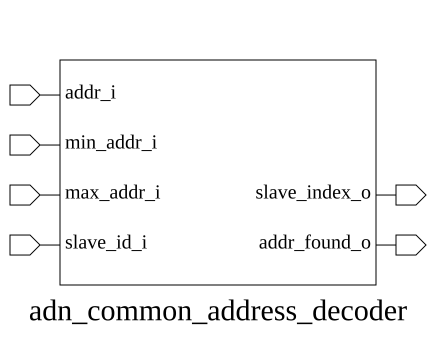

# adn_common_address_decoder (module)

### Author : Adnan Sami Anirban (adnananirban259@gmail.com)

## TOP IO

## Parameters
|Name|Type|Dimension|Default Value|Description|
|-|-|-|-|-|
|ADDR_WIDTH|int||adn_common_address_decoder_pkg::ADDR_DECODER_ADDR_WIDTH| PARAMETERS|
|SLV_INDEX_WIDTH|int||adn_common_address_decoder_pkg::ADDR_DECODER_SLV_INDEX_WIDTH||
|NUM_RULES|int||adn_common_address_decoder_pkg::ADDR_DECODER_NUM_RULES||
|addr_map_t|type||adn_common_address_decoder_pkg::addr_decoder_addr_map_t||
|ADDR_MAP|addr_map_t|[NUM_RULES]|adn_common_address_decoder_pkg::ADDR_MAP||
|HIGH_INDEX_PRIORITY|bit||0||

## Ports
|Name|Direction|Type|Dimension|Description|
|-|-|-|-|-|
|addr_i|input|logic [ADDR_WIDTH-1:0]|| PORTS|
|slave_index_o|output|logic [SLV_INDEX_WIDTH-1:0]|||
|addr_found_o|output|logic|||
## Description

@foez---bhai, write the purpose of this module in markdown format here. This is already in multi-line comment, so don't add any additional comment syntax.

@foez---bhai, describe the usage of this module in markdown format here. This is already in multi-line comment, so don't add any additional comment syntax.

| REVISION | DATE       | AUTHOR          | DESCRIPTION                                            |
|----------|------------|-----------------|--------------------------------------------------------|
| 0.1      | YYYY-MM-DD | Adnan Sami Anirban | Initial version                                        |
| 1.0      | YYYY-MM-DD | Adnan Sami Anirban | Stable release                                         |

This file is part of ADN-VLSI/adn_common
 **Copyright (c) 2026 ADN Semiconductors**
 **Licensed under the MIT License**
 **See LICENSE file in the project root for full license information**

