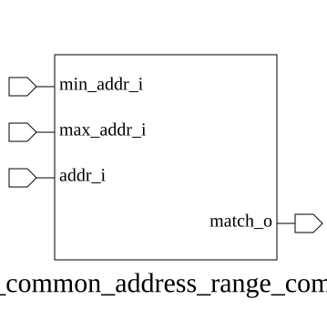

# adn_common_address_range_compare (module)

### Author : Adnan Sami Anirban (adnananirban259@gmail.com)

## TOP IO

## Parameters
|Name|Type|Dimension|Default Value|Description|
|-|-|-|-|-|
|ADDR_WIDTH|int||32| Parameter defining the bit-width of the address signals|

## Ports
|Name|Direction|Type|Dimension|Description|
|-|-|-|-|-|
|min_addr_i|input|logic [ADDR_WIDTH-1:0]|| Inclusive lower bound of the address range|
|max_addr_i|input|logic [ADDR_WIDTH-1:0]|| Exclusive upper bound of the address range|
|addr_i|input|logic [ADDR_WIDTH-1:0]|| Inclusive lower bound of the address range|
|match_o|output|logic|| Output signal: High if addr_i is within [min_addr_i, max_addr_i)|
## Description

### Purpose
This module performs a range comparison to determine if a given address falls within a specified inclusive-minimum and exclusive-maximum range. It is designed to be used in memory-mapped systems or address decoding logic to validate address access.

### Usage
To use this module, instantiate it by specifying the `ADDR_WIDTH` parameter to match your system's address bus width. Connect the lower bound of the range to `min_addr_i`, the upper bound (exclusive) to `max_addr_i`, and the address to be checked to `addr_i`. The `match_o` output will assert high if `min_addr_i <= addr_i < max_addr_i`.

| REVISION | DATE       | AUTHOR          | DESCRIPTION                                            |
|----------|------------|-----------------|--------------------------------------------------------|
| 1.0      | 2026-07-30 | Adnan Sami Anirban | Stable release                                         |

This file is part of ADN-VLSI/adn_common
 **Copyright (c) 2026 ADN Semiconductors**
 **Licensed under the MIT License**
 **See LICENSE file in the project root for full license information**

