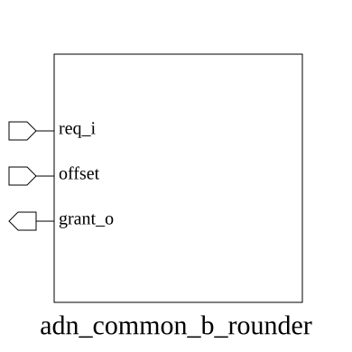

# adn_common_b_rounder (module)

### Author : Motasim Faiyaz (motasimfaiyaz@gmail.com)

## TOP IO

## Parameters
|Name|Type|Dimension|Default Value|Description|
|-|-|-|-|-|
|N|int||8| PARAMETERS|

## Ports
|Name|Direction|Type|Dimension|Description|
|-|-|-|-|-|
|req_i|input|logic [N-1:0]|| PORTS|
|offset|input|logic [$clog2(N)-1:0]|||
|grant_o|output|logic [N-1:0]|||
## Description

### Purpose
The `adn_common_b_rounder` module implements a circular barrel shifter or round-robin style bit-shifter. It takes an input vector and rotates its bits based on a provided offset, effectively performing a circular shift operation to reorder the input bits into the output grant vector.

### Usage
To use this module, instantiate it with the desired width `N`. Provide the input vector `req_i` and the rotation `offset`. The module will output the rotated vector `grant_o` such that the bit at `req_i[0]` is shifted to `grant_o[offset]`.

| REVISION | DATE       | AUTHOR          | DESCRIPTION                                            |
|----------|------------|-----------------|--------------------------------------------------------|
| 0.1      | YYYY-MM-DD | Motasim Faiyaz | Initial version                                        |
| 1.0      | YYYY-MM-DD | Motasim Faiyaz | Stable release                                         |

This file is part of ADN-VLSI/adn_common
 **Copyright (c) 2026 ADN Semiconductors**
 **Licensed under the MIT License**
 **See LICENSE file in the project root for full license information**

