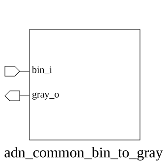

# adn_common_bin_to_gray (module)

### Author : Foez Ahmed (foez.official@gmail.com)

## TOP IO

## Parameters
|Name|Type|Dimension|Default Value|Description|
|-|-|-|-|-|
|WIDTH|int||8| Parameter defining the bit-width of the conversion logic|

## Ports
|Name|Direction|Type|Dimension|Description|
|-|-|-|-|-|
|bin_i|input|logic [WIDTH-1:0]|| Input binary vector to be converted|
|gray_o|output|logic [WIDTH-1:0]|| Output Gray-coded vector|
## Description

### Purpose
This module performs a binary-to-Gray code conversion. It takes a standard binary input and transforms it into a Gray code representation, which is essential for minimizing glitches in asynchronous clock domain crossings and multi-bit signal transitions.

### Use Case
This module is primarily used in digital systems where multi-bit signals must cross between different clock domains (e.g., FIFO pointers, counters). Because Gray code ensures that only one bit changes at a time between consecutive values, it prevents the metastable states that would otherwise occur if multiple bits were sampled simultaneously during a transition.

| REVISION | DATE       | AUTHOR          | DESCRIPTION                                            |
|----------|------------|-----------------|--------------------------------------------------------|
| 1.0      | 2026-07-29 | Foez Ahmed      | Stable release                                         |
| 1.1      | 2026-08-01 | Foez Ahmed      | Ratified                                               |

This file is part of ADN-VLSI/adn_common
 **Copyright (c) 2026 ADN Semiconductors**
 **Licensed under the MIT License**
 **See LICENSE file in the project root for full license information**

