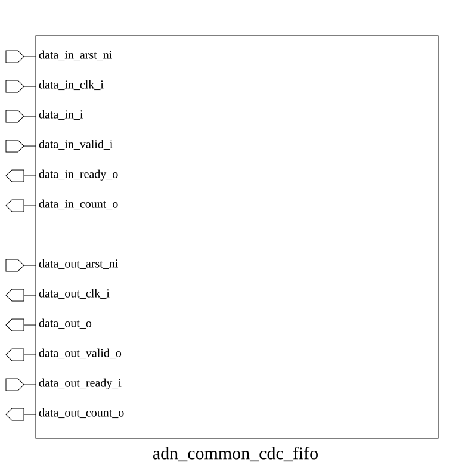
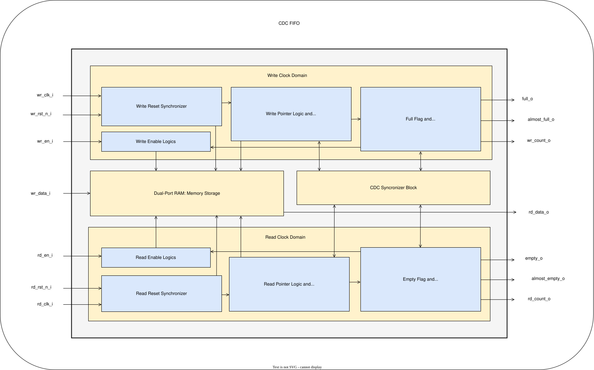

# adn_common_cdc_fifo (module)

### Author : Ahasan Ullah Khalid (aukhalid02@gmail.com)

## TOP IO

## Parameters
|Name|Type|Dimension|Default Value|Description|
|-|-|-|-|-|
|DATA_WIDTH|int||32|Width of the data bus|
|ADDR_WIDTH|int||8|Address width|
|SYNC_STAGES|int||2|Number of synchronization stages|
|ALMOST_FULL_THRESH|int||(1 << ADDR_WIDTH) - 2|Threshold for almost_full_o flag|
|ALMOST_EMPTY_THRESH|int||2|Threshold for almost_empty_o flag|

## Ports
|Name|Direction|Type|Dimension|Description|
|-|-|-|-|-|
|wr_clk_i|input|logic||Write domain clock|
|wr_rst_n_i|input|logic||Active-low asynchronous reset for write domain|
|wr_en_i|input|logic||Write enable signal|
|wr_data_i|input|logic [DATA_WIDTH-1:0]||Data input bus|
|full_o|output|logic||FIFO full flag|
|almost_full_o|output|logic||FIFO almost full flag|
|wr_count_o|output|logic [ ADDR_WIDTH:0]||Write domain occupancy count|
|rd_clk_i|input|logic||Read domain clock|
|rd_rst_n_i|input|logic||Active-low asynchronous reset for read domain|
|rd_en_i|input|logic||Read enable signal|
|rd_data_o|output|logic [DATA_WIDTH-1:0]||Data output bus|
|empty_o|output|logic||FIFO empty flag|
|almost_empty_o|output|logic||FIFO almost empty flag|
|rd_count_o|output|logic [ ADDR_WIDTH:0]||Read domain occupancy count|
## Description

### Purpose
The `adn_common_cdc_fifo` module implements a high-performance, asynchronous First-In-First-Out (FIFO) buffer designed for reliable data transfer between two independent clock domains. It utilizes Gray-coded pointers and multi-stage synchronizers to mitigate metastability issues, ensuring robust data integrity during Clock Domain Crossing (CDC). The module provides full, empty, and programmable almost-full/almost-empty status flags, along with occupancy counters to facilitate flow control in complex digital systems.

### Usage
To use the `adn_common_cdc_fifo` in your design, instantiate it by specifying the `DATA_WIDTH` and `ADDR_WIDTH` (which determines the depth as $2^{ADDR\_WIDTH}$). Connect the write-side signals (`wr_clk_i`, `wr_en_i`, `wr_data_i`) to the producer domain and the read-side signals (`rd_clk_i`, `rd_en_i`, `rd_data_o`) to the consumer domain. Ensure that `wr_rst_n_i` and `rd_rst_n_i` are asserted during power-on. The module handles CDC internally; simply monitor `full_o` and `empty_o` to prevent overflow and underflow conditions, respectively.

| REVISION | DATE       | AUTHOR              | DESCRIPTION                                            |
|----------|------------|---------------------|--------------------------------------------------------|
| 0.1      | 2026-07-27 | Ahasan Ullah Khalid | Initial version                                        |
| 1.0      | 2026-07-29 | Ahasan Ullah Khalid | Stable release                                         |

This file is part of ADN-VLSI/adn_common
 **Copyright (c) 2026 ADN Semiconductors**
 **Licensed under the MIT License**
 **See LICENSE file in the project root for full license information**

