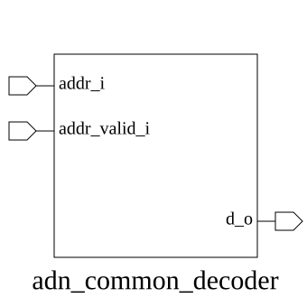

# adn_common_decoder (module)

### Author: Foez Ahmed (foez.official@gmail.com)

### Source: adn_common_decoder.sv

## Top IO

## Parameters

|Name|Type|Dimension|Default|Description|
|-|-|-|-|-|
|ADDR_WIDTH|int||2|Width of the input address bus|
|DATA_WIDTH|int||(2 ** ADDR_WIDTH)|Width of the decoded output bus|

## Ports

|Name|Direction|Type|Dimension|Description|
|-|-|-|-|-|
|addr_i|input|logic [ADDR_WIDTH-1:0]||Binary address input|
|addr_valid_i|input|logic||Validity signal for the input address|
|d_o|output|logic [DATA_WIDTH-1:0]||One-hot decoded output|

## Description

### Purpose
The `adn_common_decoder` module functions as a parameterized N-to-2^N one-hot decoder. It translates an input binary address into a one-hot encoded output signal, provided the input validity signal is asserted.

### Use-Case
This module is primarily used in memory-mapped systems, address decoding logic for peripheral selection, and state machine transitions where a binary-coded index needs to be converted into a specific enable signal for a target register or memory bank. It ensures that only one output line is active at a time, preventing bus contention and simplifying control signal routing.

| REVISION | DATE       | AUTHOR          | DESCRIPTION                                            |
|----------|------------|-----------------|--------------------------------------------------------|
| 0.1      | 2026-08-01 | Foez Ahmed      | Initial version                                        |
| 1.0      | 2026-08-01 | Foez Ahmed      | Stable release                                         |
| 1.1      | 2026-08-01 | Foez Ahmed      | Ratified                                               |

Author : Foez Ahmed (foez.official@gmail.com)
