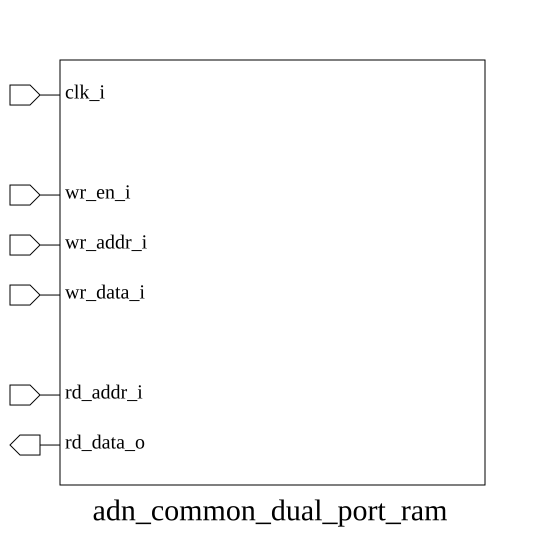

# adn_common_dual_port_ram (module)

### Author : Ahasan Ullah Khalid (aukhalid02@gmail.com)

## TOP IO


## Parameters
|Name|Type|Dimension|Default Value|Description|
|-|-|-|-|-|
|DATA_WIDTH|int||32|Width of the data bus in bits|
|ADDR_WIDTH|int||8|Width of the address bus in bits|

## Ports
|Name|Direction|Type|Dimension|Description|
|-|-|-|-|-|
|wr_clk_i|input|logic||Write clock|
|wr_rst_n_i|input|logic||Active-low asynchronous reset for write domain|
|wr_en_i|input|logic||Write enable signal|
|wr_addr_i|input|logic [ADDR_WIDTH-1:0]||Write address|
|wr_data_i|input|logic [DATA_WIDTH-1:0]||Data to be written|
|rd_clk_i|input|logic||Read clock|
|rd_rst_n_i|input|logic||Active-low asynchronous reset for read domain|
|rd_en_i|input|logic||Read enable signal|
|rd_addr_i|input|logic [ADDR_WIDTH-1:0]||Read address|
|rd_data_o|output|logic [DATA_WIDTH-1:0]||Data read from memory|
## Description


### Purpose
This module implements a synchronous dual-port RAM with independent write and read clock domains. It supports configurable data and address widths, and provides an optional output pipeline register to improve timing performance at the cost of an additional clock cycle of latency.

### Usage
To instantiate this module, define the `DATA_WIDTH` and `ADDR_WIDTH` parameters to match your memory requirements. Set `OUT_REG` to `1` if your design requires an extra pipeline stage for timing closure, or `0` for standard latency.

```systemverilog
adn_common_dual_port_ram #(
    .DATA_WIDTH(32),
    .ADDR_WIDTH(10),
    .OUT_REG(1)
) u_ram (
    .wr_clk_i(clk_a),
    .wr_rst_n_i(rst_a_n),
    .wr_en_i(we),
    .wr_addr_i(addr_a),
    .wr_data_i(data_in),
    .rd_clk_i(clk_b),
    .rd_rst_n_i(rst_b_n),
    .rd_en_i(re),
    .rd_addr_i(addr_b),
    .rd_data_o(data_out)
);
```

| REVISION | DATE       | AUTHOR          | DESCRIPTION                                            |
|----------|------------|-----------------|--------------------------------------------------------|
| 0.1      | 2026-07-28 | Ahasan Ullah Khalid | Initial version                                    |
| 1.0      | 2026-07-28 | Ahasan Ullah Khalid | Stable release                                     |

This file is part of ADN-VLSI/adn_common
<br>**Copyright (c) 2026 ADN Semiconductors**
<br>**Licensed under the MIT License**
<br>**See LICENSE file in the project root for full license information**

