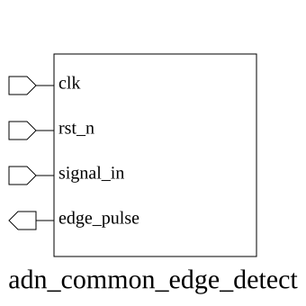
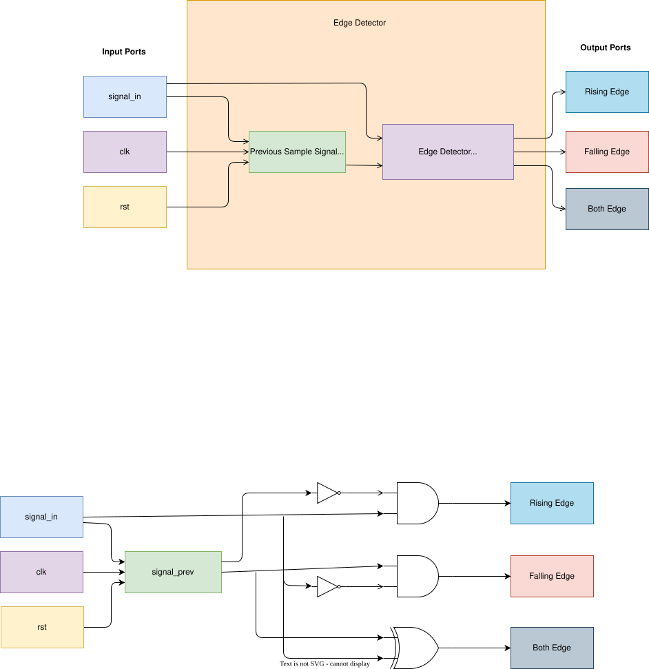

# adn_common_edge_detect (module)

### Author: Md. Sakib Hasan Shawon (mdsakibhasanshawon20@gmail.com)

### Source: adn_common_edge_detect.sv

## Top IO

## Parameters

|Name|Type|Dimension|Default|Description|
|-|-|-|-|-|
|EDGE_TYPE|int||0|Edge detection mode: 0=Falling, 1=Rising, 2=Dual|

## Ports

|Name|Direction|Type|Dimension|Description|
|-|-|-|-|-|
|clk_i|input|logic|||
|arst_ni|input|logic|||
|signal_i|input|logic|||
|edge_pulse_o|output|logic|||

## Description

### Purpose
This module provides a configurable edge detection mechanism for a single-bit input signal. It supports rising edge, falling edge, and dual-edge detection, generating a single-clock-cycle pulse whenever the specified transition occurs on the input signal relative to the system clock.

### Use Case
This module is primarily used in digital systems to synchronize asynchronous signals or to trigger state machine transitions based on specific signal changes. Common applications include:
- Generating a single-cycle trigger from a level-sensitive input (e.g., a button press or a status flag).
- Detecting the start of a data packet in serial communication protocols.
- Creating pulse-based control signals for counters or registers within a synchronous design.

Connect the system clock (`clk_i`), active-low reset (`arst_ni`), and the target signal (`signal_i`). The `edge_pulse_o` output will assert high for exactly one clock cycle when the specified transition is detected.

| REVISION | DATE       | AUTHOR                 | DESCRIPTION                                            |
|----------|------------|------------------------|--------------------------------------------------------|
| 0.1      | 2026-07-27 | Md. Sakib Hasan Shawon | Initial version                                        |
| 1.0      | 2026-07-28 | Md. Sakib Hasan Shawon | Stable release                                         |
| 1.1      | 2026-08-01 | Foez Ahmed             | Ratified                                               |
| 1.2      | 2026-08-01 | Foez Ahmed             | Cycle fix                                              |
| 1.3      | 2026-08-01 | Foez Ahmed             | Ratified                                               |

Author : Md. Sakib Hasan Shawon (mdsakibhasanshawon20@gmail.com)
