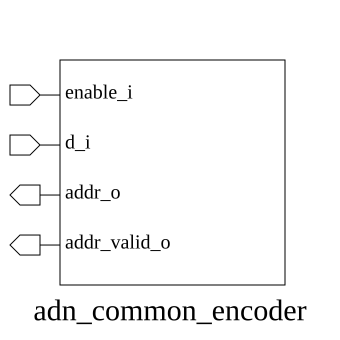

# adn_common_encoder (module)

### Author : Shykul Islam Siam (shykulislam32@gmail.com)

## TOP IO

## Parameters
|Name|Type|Dimension|Default Value|Description|
|-|-|-|-|-|
|NUM_WIRE|int||4|Number of input wires; must be at least two.|

## Ports
|Name|Direction|Type|Dimension|Description|
|-|-|-|-|-|
|enable_i|input|logic||Enables address selection and valid output.|
|d_i|input|logic [ NUM_WIRE-1:0]||Input bits to encode.|
|addr_o|output|logic [$clog2(NUM_WIRE)-1:0]||Address of the selected input bit.|
|addr_valid_o|output|logic||Indicates a valid encoded address.|
## Description

### Purpose

The `adn_common_encoder` converts an asserted bit in `d_i` into its binary address. When more than
one input bit is asserted, the lowest index wins. `enable_i` disables both the address-valid output
and address selection when low.

### Usage

Set `NUM_WIRE` to the number of input bits, assert `enable_i`, and drive `d_i`. `addr_o` identifies
the selected input when `addr_valid_o` is high.

| REVISION | DATE       | AUTHOR             | DESCRIPTION     |
|----------|------------|--------------------|-----------------|
| 0.1      | 2026-07-30 | Shykul Islam Siam  | Initial version |
| 1.0      | 2026-07-30 | Shykul Islam Siam  | Stable release  |

This file is part of ADN-VLSI/adn_common
 **Copyright (c) 2026 ADN Semiconductors**
 **Licensed under the MIT License**
 **See LICENSE file in the project root for full license information**

