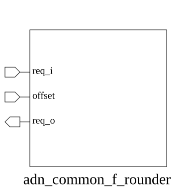

# adn_common_f_rounder (module)

### Author : Motasim Faiyaz (motasimfaiyaz@gmail.com)

## TOP IO

## Parameters
|Name|Type|Dimension|Default Value|Description|
|-|-|-|-|-|
|N|int||8|Width of the input and output vectors|

## Ports
|Name|Direction|Type|Dimension|Description|
|-|-|-|-|-|
|req_i|input|logic [N-1:0]||Input vector to be rotated|
|offset|input|logic [$clog2(N)-1:0]||Rotation amount (left shift)|
|req_o|output|logic [N-1:0]||Rotated output vector|
## Description

### Purpose
The `adn_common_f_rounder` module implements a circular shifter (or barrel shifter) that rotates the input bit vector `req_i` by a specified `offset` to produce the output `req_o`. This is typically used in round-robin arbitration schemes or circular buffer indexing where elements need to be reordered based on a dynamic priority or starting position.

### Usage
To use this module, instantiate it by specifying the width `N` of the input vector. Provide the data to be rotated on the `req_i` port and the rotation amount on the `offset` port. The module will perform a left-circular shift, where the bit at index `offset` of the input becomes the bit at index 0 of the output.

| REVISION | DATE       | AUTHOR          | DESCRIPTION                                            |
|----------|------------|-----------------|--------------------------------------------------------|
| 0.1      | YYYY-MM-DD | Motasim Faiyaz | Initial version                                        |
| 1.0      | YYYY-MM-DD | Motasim Faiyaz | Stable release                                         |

This file is part of ADN-VLSI/adn_common
 **Copyright (c) 2026 ADN Semiconductors**
 **Licensed under the MIT License**
 **See LICENSE file in the project root for full license information**

