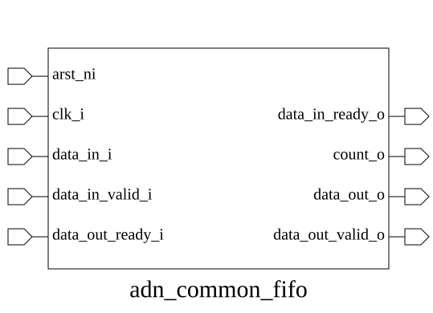

# adn_common_fifo (module)

### Author : Annim (jannatannim@gmail.com)

## TOP IO

## Parameters
|Name|Type|Dimension|Default Value|Description|
|-|-|-|-|-|
|DATA_WIDTH|int||32| //////////////////////////////////////////////////////////////////////////////////////////////// PARAMETERS ////////////////////////////////////////////////////////////////////////////////////////////////|
|DEPTH|int||16||
|ADDR_WIDTH|int||$clog2(DEPTH)| //////////////////////////////////////////////////////////////////////////////////////////////// LOCALPARAMS ////////////////////////////////////////////////////////////////////////////////////////////////|

## Ports
|Name|Direction|Type|Dimension|Description|
|-|-|-|-|-|
|clk_i|input|logic|| //////////////////////////////////////////////////////////////////////////////////////////////// PORTS ////////////////////////////////////////////////////////////////////////////////////////////////|
|rst_ni|input|logic|||
|wr_en_i|input|logic|||
|rd_en_i|input|logic|||
|data_i|input|logic [DATA_WIDTH-1:0]|||
|data_o|output|logic [DATA_WIDTH-1:0]|||
|full_o|output|logic|||
|empty_o|output|logic|||
|valid_o|output|logic|||
## Description

### Purpose
This module implements a synchronous First-In-First-Out (FIFO) buffer designed for data flow control between clock domains or modules. It provides a configurable data width and depth, utilizing a circular buffer architecture to manage data storage and retrieval with full/empty status flags.

### Use Case
The `adn_common_fifo` is primarily used to decouple producers and consumers that operate at different rates or require buffering to prevent data loss during bursts. Typical applications include:
- **Data Streaming:** Buffering packets between a high-speed interface (e.g., AXI, SPI) and a processing core.
- **Clock Domain Crossing (CDC):** Acting as a staging area for data moving between synchronous domains (when managed with appropriate synchronization logic).
- **Flow Control:** Providing backpressure mechanisms in pipelines to ensure that data is not overwritten before it is consumed.

| REVISION | DATE       | AUTHOR          | DESCRIPTION                                            |
|----------|------------|-----------------|--------------------------------------------------------|
| 0.1      | 2026-07-27 | Annim Jannat    | Initial version                                        |
| 1.0      | 2026-07-28 | Annim Jannat    | Stable release                                         |

This file is part of ADN-VLSI/adn_common
 **Copyright (c) 2026 ADN Semiconductors**
 **Licensed under the MIT License**
 **See LICENSE file in the project root for full license information**

