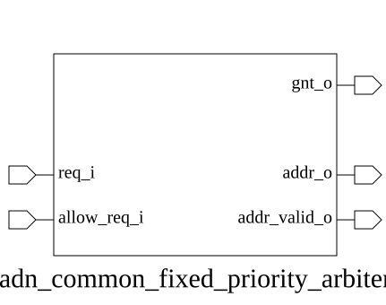

# adn_common_fixed_priority_arbiter (module)

### Author: Shykul Islam Siam (shykulislam32@gmail.com)

### Source: adn_common_fixed_priority_arbiter.sv

## Top IO

## Parameters

|Name|Type|Dimension|Default|Description|
|-|-|-|-|-|
|NUM_REQ|int||4|Number of request lines; must be at least one.|
|HIGH_INDEX_PRIORITY|bit||0|When set, the highest index request has priority.|

## Ports

|Name|Direction|Type|Dimension|Description|
|-|-|-|-|-|
|req_i|input|logic [NUM_REQ-1:0]||Request vector, higher index has higher priority|
|allow_req_i|input|logic||Global enable signal to permit granting|
|gnt_o|output|logic [NUM_REQ-1:0]||One-hot encoded grant output|

## Description

### Purpose
This module implements a fixed-priority arbiter that selects a single request from a multi-bit input vector based on a predefined priority scheme. It utilizes a priority encoder to determine the highest-priority active request and a decoder to generate a one-hot encoded grant signal, ensuring only one requester is granted access at any given time.

### Use-Case
This module is typically employed in bus interconnects, memory controllers, or any multi-master system where multiple agents compete for a shared resource. By enforcing a fixed-priority policy, it ensures that critical agents (e.g., high-bandwidth DMA engines or real-time processors) are serviced before lower-priority tasks, preventing resource contention and ensuring deterministic access latency.

| REVISION | DATE       | AUTHOR             | DESCRIPTION                                         |
|----------|------------|--------------------|-----------------------------------------------------|
| 0.1      | 2026-07-30 | Shykul Islam Siam  | Initial version                                     |
| 1.0      | 2026-07-30 | Shykul Islam Siam  | Stable release                                      |
| 1.1      | 2026-08-01 | Foez Ahmed         | Ports Fixed and simplified logic                    |
| 1.2      | 2026-08-01 | Foez Ahmed         | Ratified                                            |

Author : Shykul Islam Siam (shykulislam32@gmail.com)
