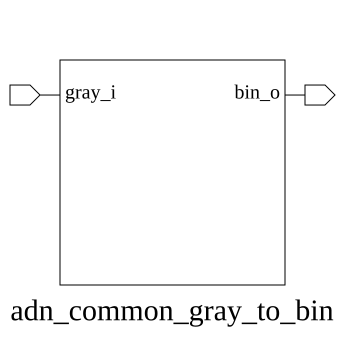

# adn_common_gray_to_bin (module)

### Author: Foez Ahmed (foez.official@gmail.com)

### Source: adn_common_gray_to_bin.sv

## Top IO

## Parameters

|Name|Type|Dimension|Default|Description|
|-|-|-|-|-|
|WIDTH|int||8||

## Ports

|Name|Direction|Type|Dimension|Description|
|-|-|-|-|-|
|gray_i|input|logic [WIDTH-1:0]||Gray-coded input vector|
|bin_o|output|logic [WIDTH-1:0]||Binary-coded output vector|

## Description

### Purpose
This module performs a combinatorial conversion of a Gray-coded input vector to its equivalent binary representation. It is designed to be generic, supporting arbitrary bit-widths defined by the `WIDTH` parameter.

### Use Case
This module is primarily used in clock domain crossing (CDC) interfaces, such as asynchronous FIFOs, where Gray code is employed to ensure that only one bit changes at a time between successive values. By converting the Gray-coded pointer back to binary, the system can perform arithmetic operations (like calculating FIFO depth or comparing pointers) that are not natively supported by Gray code.

| REVISION | DATE       | AUTHOR          | DESCRIPTION                                            |
|----------|------------|-----------------|--------------------------------------------------------|
| 1.0      | 2026-07-29 | Foez Ahmed      | Stable release                                         |
| 1.1      | 2026-08-01 | Foez Ahmed      | Ratified                                               |

Author : Foez Ahmed (foez.official@gmail.com)
