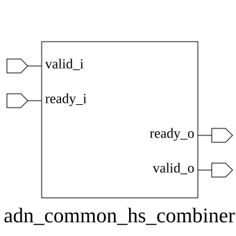

# adn_common_hs_combiner (module)

### Author : Foez Ahmed (foez.official@gmail.com)

## TOP IO

## Parameters
|Name|Type|Dimension|Default Value|Description|
|-|-|-|-|-|
|NUM_TX|int||2|Number of input handshake channels|
|NUM_RX|int||2|Number of output handshake channels|

## Ports
|Name|Direction|Type|Dimension|Description|
|-|-|-|-|-|
|valid_i|input|logic [NUM_TX-1:0]||Input valid signals from source|
|ready_o|output|logic [NUM_TX-1:0]||Output ready signals back to source|
|valid_o|output|logic [NUM_RX-1:0]||Output valid signals to destination|
|ready_i|input|logic [NUM_RX-1:0]||Input ready signals from destination|
## Description

# Handshake Combiner Module

This module serves as a synchronization and aggregation unit that combines multiple handshake interfaces. It ensures that data transmission only proceeds when all input valid signals and all output ready signals are simultaneously asserted, effectively acting as a multi-channel AND-gate for handshake protocols.

## Usage
The `hs_combiner` is designed to synchronize multiple handshake channels. It monitors `NUM_TX` input channels and `NUM_RX` output channels. The module asserts the output valid signals and input ready signals only when all input valid signals are high and all output ready signals are high. This is typically used in data-path synchronization where multiple streams must be aligned before processing.

| REVISION | DATE       | AUTHOR          | DESCRIPTION                                            |
|----------|------------|-----------------|--------------------------------------------------------|
| 1.0      | 2026-07-22 | Foez Ahmed      | Stable release                                         |
| 1.1      | 2026-08-01 | Foez Ahmed      | Ratified                                               |

This file is part of ADN-VLSI/adn_common
 **Copyright (c) 2026 ADN Semiconductors**
 **Licensed under the MIT License**
 **See LICENSE file in the project root for full license information**

