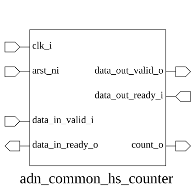

# adn_common_hs_counter (module)

### Author: Annim Jannat (jannatannim@gmail.com)

### Source: adn_common_hs_counter.sv

## Top IO

## Parameters

|Name|Type|Dimension|Default|Description|
|-|-|-|-|-|
|DEPTH|int||8||

## Ports

|Name|Direction|Type|Dimension|Description|
|-|-|-|-|-|
|clk_i|input|logic||System clock|
|arst_ni|input|logic||Active-low asynchronous reset|
|data_in_valid_i|input|logic||Input data valid signal|
|data_in_ready_o|output|logic||Input data ready signal (backpressure)|
|data_out_valid_o|output|logic||Output data valid signal|
|data_out_ready_i|input|logic||Output data ready signal|
|count_o|output|logic [$clog2(DEPTH+1)-1:0]||Current occupancy count|

## Description

### Purpose
This module implements a handshake-based counter designed to track the number of active data elements within a buffer or pipeline stage. It monitors input and output handshakes to increment or decrement the internal count, ensuring the counter remains within the bounds of the specified `DEPTH`.

### Use Case
This module is primarily used in streaming architectures to manage flow control and occupancy tracking. It is ideal for:
- **FIFO Depth Monitoring:** Tracking how many slots are currently occupied in a buffer.
- **Backpressure Management:** Generating `ready` signals based on current occupancy to prevent buffer overflows.
- **Pipeline Monitoring:** Providing visibility into the number of valid data packets currently traversing a multi-stage pipeline.

| REVISION | DATE       | AUTHOR          | DESCRIPTION                                            |
|----------|------------|-----------------|--------------------------------------------------------|
| 0.1      | 2026-07-27 | Annim Jannat    | Initial version                                        |
| 1.0      | 2026-07-29 | Annim Jannat    | Stable release                                         |
| 1.1      | 2026-08-01 | Foez Ahmed      | Ratified                                               |

Author : Annim Jannat (jannatannim@gmail.com)
