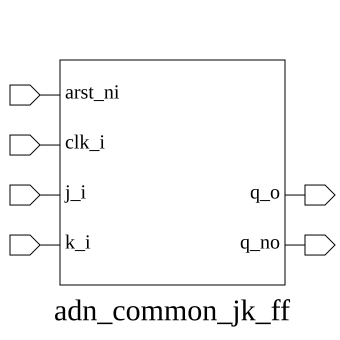
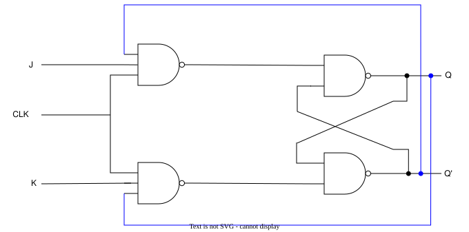

# adn_common_jk_ff (module)

### Author : Shuparna Haque (sheikhshuparna3108@gmail.com)

## TOP IO

## Parameters
|Name|Type|Dimension|Default Value|Description|
|-|-|-|-|-|

## Ports
|Name|Direction|Type|Dimension|Description|
|-|-|-|-|-|
|arst_ni|input|logic||Active-low asynchronous reset|
|clk_i|input|logic||Clock input|
|j_i|input|logic||J input|
|k_i|input|logic||Clock input|
|q_o|output|logic||Output state|
## Description

The `adn_common_jk_ff` module implements a standard JK flip-flop with an active-low asynchronous reset. It serves as a fundamental sequential building block, providing the logic to toggle, set, reset, or hold its output state based on the J and K inputs at the rising edge of the clock signal.

## Usage
To use this module, instantiate it in your Verilog/SystemVerilog design by connecting the `clk_i` to your system clock, `arst_ni` to your reset signal, and the `j_i` and `k_i` inputs to your control logic. The `q_o` port will reflect the state of the flip-flop based on the following truth table:
- If `j=0, k=0`: Hold state.
- If `j=0, k=1`: Reset state (`q=0`).
- If `j=1, k=0`: Set state (`q=1`).
- If `j=1, k=1`: Toggle state (`q=~q`).

| REVISION | DATE       | AUTHOR          | DESCRIPTION                                            |
|----------|------------|-----------------|--------------------------------------------------------|
| 1.0      | 2026-05-04 | Shuparna Haque  | Stable release                                         |

 **This file is part of https://github.com/ADN-VLSI/adn_common**
 **Copyright (c) 2026 ADN Semiconductors**
 **Licensed under the MIT License**
 **See LICENSE file in the project root for full license information**
