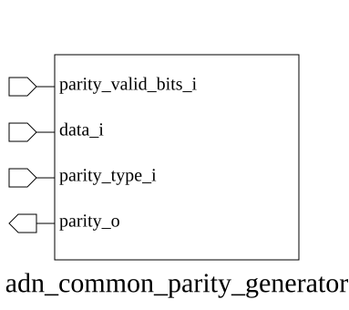

# adn_common_parity_generator (module)

### Author : Ahasan Ullah Khalid (aukhalid02@gmail.com)

## TOP IO

## Parameters
|Name|Type|Dimension|Default Value|Description|
|-|-|-|-|-|
|DATA_WIDTH|int||8|Width of the input data vector|

## Ports
|Name|Direction|Type|Dimension|Description|
|-|-|-|-|-|
|data_i|input|logic [ DATA_WIDTH-1:0]||Input data to calculate parity for|
|parity_valid_bits_i|input|logic [clog2(DATA_WIDTH)-1:0]||Number of bits to consider for parity|
|parity_type_i|input|logic||1 for even parity, 0 for odd parity|
|parity_o|output|logic||Calculated parity bit|
## Description

### Purpose
This module generates a parity bit for a given input data vector. It supports configurable data widths and allows for dynamic selection between even and odd parity modes based on a specified number of valid bits.

### Use Case
This module is primarily used in communication interfaces and memory controllers where data integrity verification is required. By allowing dynamic selection of the number of valid bits and parity type (even/odd), it provides a flexible solution for error detection in systems handling variable-length data packets or protocols requiring specific parity schemes.

| REVISION | DATE       | AUTHOR              | DESCRIPTION                                        |
|----------|------------|---------------------|----------------------------------------------------|
| 0.1      | 2026-08-02 | Ahasan Ullah Khalid | Initial version                                    |
| 1.0      | 2026-08-02 | Ahasan Ullah Khalid | Stable release                                     |

This file is part of ADN-VLSI/adn_common
 **Copyright (c) 2026 ADN Semiconductors**
 **Licensed under the MIT License**
 **See LICENSE file in the project root for full license information**

