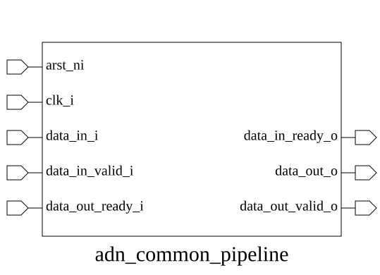

# adn_common_pipeline (module)

### Author : Foez Ahmed (foez.official@gmail.com)

## TOP IO

## Parameters
|Name|Type|Dimension|Default Value|Description|
|-|-|-|-|-|
|DATA_WIDTH|int||32|Data bus width|

## Ports
|Name|Direction|Type|Dimension|Description|
|-|-|-|-|-|
|arst_ni|input|logic||Active-low asynchronous reset|
|clk_i|input|logic||Rising-edge clock|
|data_in_i|input|logic [DATA_WIDTH-1:0]||Input data|
|data_in_valid_i|input|logic||Input data valid|
|data_in_ready_o|output|logic||Input ready (backpressure to upstream)|
|data_out_o|output|logic [DATA_WIDTH-1:0]||Output data|
|data_out_valid_o|output|logic||Output data valid|
|data_out_ready_i|input|logic||Output ready (backpressure from downstream)|
## Description

### Purpose
The `adn_common_pipeline` module implements a single-stage pipeline register with a standard ready/valid handshake protocol. It acts as a buffer to decouple timing paths between upstream and downstream modules, allowing for improved clock frequency by inserting a register stage in the data path while maintaining flow control.

### Usage
To use this module, instantiate it between two modules communicating via a ready/valid interface. Connect the upstream module's `data`, `valid`, and `ready` signals to the `data_in_*` ports, and the downstream module's signals to the `data_out_*` ports. The module will automatically buffer one word of data, asserting `data_in_ready_o` when it is ready to accept new data and driving `data_out_valid_o` when it has data ready for the downstream consumer.

| REVISION | DATE       | AUTHOR          | DESCRIPTION                                            |
|----------|------------|-----------------|--------------------------------------------------------|
| 1.0      | 2026-07-20 | Foez Ahmed      | Stable release                                         |
| 1.1      | 2026-08-01 | Foez Ahmed      | Ratified                                               |

 **This file is part of https://github.com/ADN-VLSI/adn_common**
 **Copyright (c) 2026 ADN Semiconductors**
 **Licensed under the MIT License**
 **See LICENSE file in the project root for full license information**

