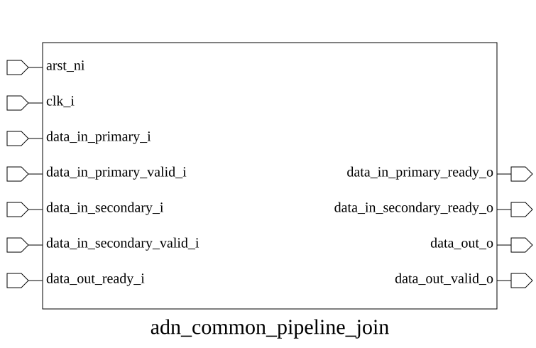

# adn_common_pipeline_join (module)

### Author: Foez Ahmed (foez.official@gmail.com)

### Source: adn_common_pipeline_join.sv

## Top IO

## Parameters

|Name|Type|Dimension|Default|Description|
|-|-|-|-|-|
|DATA_WIDTH|int||32|Data bus width|

## Ports

|Name|Direction|Type|Dimension|Description|
|-|-|-|-|-|
|arst_ni|input|logic||Active-low asynchronous reset|
|clk_i|input|logic||Rising-edge clock|
|data_in_secondary_i|input|logic [DATA_WIDTH-1:0]||Input data|
|data_in_secondary_valid_i|input|logic||Input data valid|
|data_in_secondary_ready_o|output|logic||Input ready|
|data_in_primary_i|input|logic [DATA_WIDTH-1:0]||Input data|
|data_in_primary_valid_i|input|logic||Input data valid|
|data_in_primary_ready_o|output|logic||Input ready|
|data_out_o|output|logic [DATA_WIDTH-1:0]||Output data|
|data_out_valid_o|output|logic||Output data valid|
|data_out_ready_i|input|logic||Output ready|

## Description

### Purpose
This module implements a priority-based joiner for two input streams (primary and secondary). It multiplexes the input data into a single pipeline, prioritizing the primary stream while ensuring that secondary data is only processed when the primary stream is idle. The combined stream is then passed through a standard pipeline stage to maintain timing and flow control.

### Use Case
This module is ideal for scenarios where a high-priority control or data stream must be merged with a lower-priority background stream without stalling the primary path. Common applications include:
- **Interrupt Handling:** Merging asynchronous interrupt requests into a main processing pipeline.
- **Telemetry/Logging:** Injecting background diagnostic data into a primary data bus only when the bus is not actively transmitting high-priority payload.
- **Resource Sharing:** Allowing multiple masters to share a single downstream interface where one master is latency-sensitive and the other is throughput-oriented.

| REVISION | DATE       | AUTHOR          | DESCRIPTION                                            |
|----------|------------|-----------------|--------------------------------------------------------|
| 0.1      | 2026-08-06 | Foez Ahmed      | Initial version                                        |
| 1.0      | 2026-08-06 | Foez Ahmed      | Stable release                                         |

Author : Foez Ahmed (foez.official@gmail.com)
