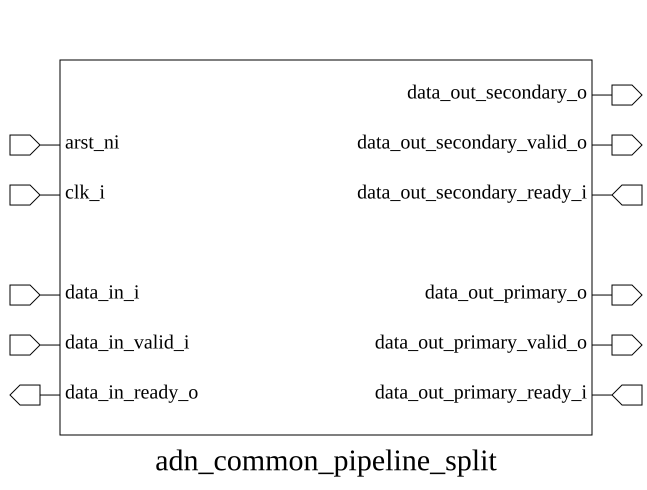

# adn_common_pipeline_split (module)

### Author: Foez Ahmed (foez.official@gmail.com)

### Source: adn_common_pipeline_split.sv

## Top IO

## Parameters

|Name|Type|Dimension|Default|Description|
|-|-|-|-|-|
|DATA_WIDTH|int||32|Data bus width|

## Ports

|Name|Direction|Type|Dimension|Description|
|-|-|-|-|-|
|arst_ni|input|logic||Active-low asynchronous reset|
|clk_i|input|logic||Rising-edge clock|
|clear_i|input|logic||Synchronous clear to flush pipeline|
|data_in_i|input|logic [DATA_WIDTH-1:0]||Input data|
|data_in_valid_i|input|logic||Input data valid|
|data_in_ready_o|output|logic||Input ready|
|data_out_secondary_o|output|logic [DATA_WIDTH-1:0]||Output data|
|data_out_secondary_valid_o|output|logic||Output data valid|
|data_out_secondary_ready_i|input|logic||Output ready|
|data_out_primary_o|output|logic [DATA_WIDTH-1:0]||Output data|
|data_out_primary_valid_o|output|logic||Output data valid|
|data_out_primary_ready_i|input|logic||Output ready|

## Description

### Purpose
This module implements a pipeline splitter that takes a single upstream data stream and broadcasts
it to two downstream interfaces. It manages flow control by asserting readiness when either
downstream interface is ready, ensuring data is distributed according to the handshake logic of the
connected consumers.

### Use Case
The `adn_common_pipeline_split` module is primarily used in high-performance data path architectures
where a single data source needs to be replicated to multiple processing units or monitoring
interfaces simultaneously. Common scenarios include:
- **Data Mirroring:** Sending a copy of the data stream to a debug/trace unit while the primary
stream continues to the main processing logic.
- **Parallel Processing:** Distributing the same input data to two different functional blocks that
operate on the data concurrently.
- **Redundancy:** Feeding identical data to two identical hardware modules to implement
fault-tolerant or lock-step checking mechanisms.

### Warnings
The module prioritizes the primary output interface. If both the downstream interfaces are not
ready, the secondary output will see valid, but when on the next cycle, both are ready, the
secondary will not see valid signal being asserted. This behavior is by design to ensure that the
primary output has precedence in receiving data. This violates the typical handshake protocol,
however, this is the intended behavior.

| REVISION | DATE       | AUTHOR          | DESCRIPTION                                            |
|----------|------------|-----------------|--------------------------------------------------------|
| 0.1      | 2026-08-06 | Foez Ahmed      | Initial version                                        |
| 1.0      | 2026-08-06 | Foez Ahmed      | Stable release                                         |

Author : Foez Ahmed (foez.official@gmail.com)
