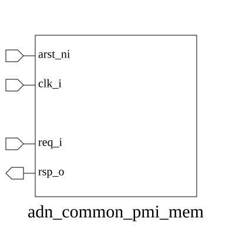

# adn_common_pmi_mem (module)

### Author: Foez Ahmed (foez.official@gmail.com)

### Source: adn_common_pmi_mem.sv

## Top IO

## Parameters

|Name|Type|Dimension|Default|Description|
|-|-|-|-|-|
|pmi_req_t|type||logic||
|pmi_rsp_t|type||logic||
|LATENCY|int||5||

## Ports

|Name|Direction|Type|Dimension|Description|
|-|-|-|-|-|
|arst_ni|input|logic|||
|clk_i|input|logic|||
|req_i|input|pmi_req_t|||
|rsp_o|output|pmi_rsp_t|||

## Description

@foez---bhai, write the purpose of this module in markdown format here. This is already in multi-line comment, so don't add any additional comment syntax.

@foez---bhai, describe the use case of this module in markdown format here. This is already in multi-line comment, so don't add any additional comment syntax.

| REVISION | DATE       | AUTHOR          | DESCRIPTION                                            |
|----------|------------|-----------------|--------------------------------------------------------|
| 0.1      | 2026-09-14 | Foez Ahmed | Initial version                                        |
| 1.0      | 2026-09-14 | Foez Ahmed | Stable release                                         |

Author : Foez Ahmed (foez.official@gmail.com)
