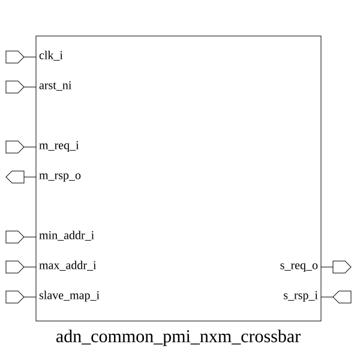

# adn_common_pmi_nxm_crossbar (module)

### Author: Ahasan Ullah Khalid (aukhalid02@gmail.com), Md Sakib Hasan SHawon, Md Sakhawat Hossain Sabbir, Annim Jannat

### Source: adn_common_pmi_nxm_crossbar.sv

## Top IO

## Parameters

|Name|Type|Dimension|Default|Description|
|-|-|-|-|-|
|NUM_MASTERS|int||4||
|NUM_SLAVES|int||4||
|ADDR_WIDTH|int||32||
|DATA_WIDTH|int||32||
|NUM_RULES|int||4||
|FIFO_DEPTH_LOG2|int||4||
|pmi_req_t|type||logic||
|pmi_rsp_t|type||logic||
|MID_W|int||(NUM_MASTERS > 1) ? $clog2(NUM_MASTERS) : 1|Derived parameters|
|SID_W|int||(NUM_SLAVES > 1) ? $clog2(NUM_SLAVES) : 1||
|TRACK_W|int||SID_W + 1|TRACK_W: SID bits + 1 decode-error flag bit|
|DEC_ERR_SID|logic [TRACK_W-1:0]||TRACK_W'(NUM_SLAVES)||
|REQ_W|int||ADDR_WIDTH + 1 + DATA_WIDTH + (DATA_WIDTH / 8) + 1|Request flat bus: maddr + mwe + mwdata + mstrb + mreq|
|RSP_PAYLOAD_W|int||DATA_WIDTH + 1|Response payload (no mgnt/mack — those are control, not data)|

## Ports

|Name|Direction|Type|Dimension|Description|
|-|-|-|-|-|
|clk_i|input|logic|||
|arst_ni|input|logic|||
|m_req_i|input|pmi_req_t [NUM_MASTERS-1:0]||Master ports (crossbar acts as slave toward these)|
|m_rsp_o|output|pmi_rsp_t [NUM_MASTERS-1:0]|||
|s_req_o|output|pmi_req_t [NUM_SLAVES-1:0]||Slave ports (crossbar acts as master toward these)|
|s_rsp_i|input|pmi_rsp_t [NUM_SLAVES-1:0]|||
|min_addr_i|input|logic [ADDR_WIDTH-1:0]|[NUM_RULES]|Static address map (tie to constants at SoC level)|
|max_addr_i|input|logic [ADDR_WIDTH-1:0]|[NUM_RULES]||
|slave_map_i|input|logic [ SID_W-1:0]|[NUM_RULES]||

## Description

@foez---bhai, write the purpose of this module in markdown format here. This is already in multi-line comment, so don't add any additional comment syntax.

@foez---bhai, describe the use case of this module in markdown format here. This is already in multi-line comment, so don't add any additional comment syntax.

| REVISION | DATE       | AUTHOR                                                                               | DESCRIPTION                                            |
|----------|------------|--------------------------------------------------------------------------------------|--------------------------------------------------------|
| 0.1      | 2026-09-15 | Ahasan Ullah Khalid                                                                  | Initial version                                        |
| 1.0      | 2026-09-15 | Ahasan Ullah Khalid, Md Sakib Hasan SHawon, Md Sakhawat Hossain Sabbir, Annim Jannat | Stable release                                         |

Author : Ahasan Ullah Khalid (aukhalid02@gmail.com), Md Sakib Hasan SHawon, Md Sakhawat Hossain Sabbir, Annim Jannat
