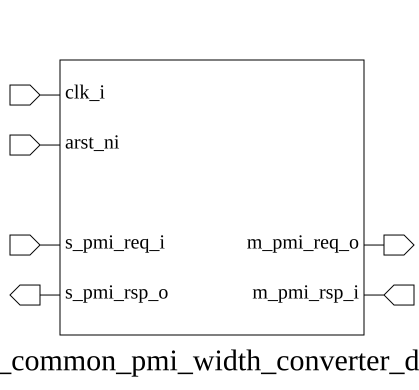

# adn_common_pmi_width_converter_down (module)

### Author: Shuparna Haque (sheikhshuparna3108@gmail.com)

### Source: adn_common_pmi_width_converter_down.sv

## Top IO

## Parameters

|Name|Type|Dimension|Default|Description|
|-|-|-|-|-|
|s_req_t|type||logic|Source request type|
|s_rsp_t|type||logic|Source response type|
|m_req_t|type||logic|Destination request type|
|m_rsp_t|type||logic|Destination response type|

## Ports

|Name|Direction|Type|Dimension|Description|
|-|-|-|-|-|
|clk_i|input|logic||System clock|
|arst_ni|input|logic||Active-low asynchronous reset|
|s_pmi_req_i|input|s_req_t||Source PMI request input|
|s_pmi_rsp_o|output|s_rsp_t||Source PMI response output|
|m_pmi_req_o|output|m_req_t||Destination PMI request output|
|m_pmi_rsp_i|input|m_rsp_t||Destination PMI response input|

## Description

### Purpose
This module implements a width converter for the PMI (Parallel Memory Interface) protocol, designed to downsize the data bus width from a wider source interface to a narrower destination interface. It handles the serialization of wide write transactions and the deserialization of narrow read responses, ensuring data integrity across different bus widths.

### Use Case
This module is primarily used in SoC interconnects or memory controllers where a high-bandwidth master (e.g., a CPU or DMA engine) needs to communicate with a lower-bandwidth peripheral or memory slave. It acts as a bridge, breaking down large, wide-bus transactions into multiple smaller beats that the narrower slave interface can process, and reassembling the fragmented read responses back into the original wide format expected by the master.

| REVISION | DATE       | AUTHOR          | DESCRIPTION                                            |
|----------|------------|-----------------|--------------------------------------------------------|
| 1.0      | 2026-08-25 | Shuparna Haque  | Initial version                                        |
| 1.0      | 2026-08-25 | Shuparna Haque  | Stable release                                         |

Author : Shuparna Haque (sheikhshuparna3108@gmail.com)
