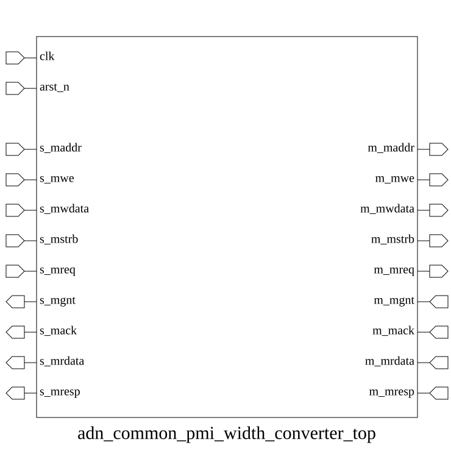

# adn_common_pmi_width_converter_top (module)

### Author: Motasim Faiyaz (motasimfaiyaz@gmail.com)

### Source: adn_common_pmi_width_converter_top.sv

## Top IO

## Parameters

|Name|Type|Dimension|Default|Description|
|-|-|-|-|-|
|ADDR_WIDTH|int||32|Width of the address bus|
|IN_DATA_WIDTH|int||32|Width of the input data bus|
|OUT_DATA_WIDTH|int||64|Width of the output data bus|

## Ports

|Name|Direction|Type|Dimension|Description|
|-|-|-|-|-|
|clk|input|logic||System clock|
|arst_n|input|logic||Active-low asynchronous reset|
|s_maddr|input|logic [ADDR_WIDTH-1:0]||Slave address|
|s_mwe|input|logic||Slave write enable|
|s_mwdata|input|logic [IN_DATA_WIDTH-1:0]||Slave write data|
|s_mstrb|input|logic [(IN_DATA_WIDTH/8)-1:0]||Slave write strobe|
|s_mreq|input|logic||Slave request|
|s_mgnt|output|logic||Slave grant|
|s_mack|output|logic||Slave acknowledge|
|s_mrdata|output|logic [IN_DATA_WIDTH-1:0]||Slave read data|
|s_mresp|output|logic||Slave response|
|m_maddr|output|logic [ADDR_WIDTH-1:0]||Master address|
|m_mwe|output|logic||Master write enable|
|m_mwdata|output|logic [OUT_DATA_WIDTH-1:0]||Master write data|
|m_mstrb|output|logic [(OUT_DATA_WIDTH/8)-1:0]||Master write strobe|
|m_mreq|output|logic||Master request|
|m_mgnt|input|logic||Master grant|
|m_mack|input|logic||Master acknowledge|
|m_mrdata|input|logic [OUT_DATA_WIDTH-1:0]||Master read data|
|m_mresp|input|logic||Master response|

## Description

### Purpose
This module serves as a top-level wrapper for a PMI (Parallel Memory Interface) width converter. It dynamically instantiates either an up-converter or a down-converter based on the relationship between the input and output data widths, or acts as a passthrough if the widths are identical.

### Use Case
This module is primarily used in SoC interconnects or memory subsystems where a master device with a specific data bus width needs to communicate with a slave device or memory controller that has a different data bus width. It abstracts the complexity of data serialization/deserialization, allowing seamless integration between mismatched PMI interfaces.

| REVISION | DATE       | AUTHOR          | DESCRIPTION                                            |
|----------|------------|-----------------|--------------------------------------------------------|
| 0.1      | 2026-08-30 | Motasim Faiyaz | Initial version                                        |
| 1.0      | 2026-08-30 | Motasim Faiyaz | Stable release                                         |

Author : Motasim Faiyaz (motasimfaiyaz@gmail.com)
