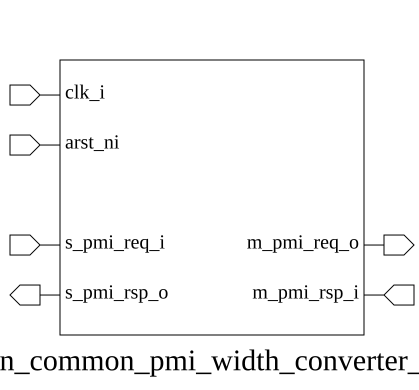

# adn_common_pmi_width_converter_up (module)

### Author: Motasim Faiyaz (motasimfaiyaz@gmail.com)

### Source: adn_common_pmi_width_converter_up.sv

## Top IO

## Parameters

|Name|Type|Dimension|Default|Description|
|-|-|-|-|-|
|ADDR_WIDTH|int||32|Width of the address bus|
|S_DATA_WIDTH|int||32|Width of the upstream (narrow) data bus|
|M_DATA_WIDTH|int||64|Width of the downstream (wide) data bus|
|s_req_t|type||s_pmi_req_t|Upstream request type|
|s_rsp_t|type||s_pmi_rsp_t|Upstream response type|
|m_req_t|type||m_pmi_req_t|Downstream request type|
|m_rsp_t|type||m_pmi_rsp_t|Downstream response type|

## Ports

|Name|Direction|Type|Dimension|Description|
|-|-|-|-|-|
|clk_i|input|logic||System clock|
|arst_ni|input|logic||Active-low asynchronous reset|
|s_pmi_req_i|input|s_req_t||Upstream request input|
|s_pmi_rsp_o|output|s_rsp_t||Upstream response output|
|m_pmi_req_o|output|m_req_t||Downstream request output|
|m_pmi_rsp_i|input|m_rsp_t||Downstream response input|

## Description

### Purpose
The `adn_common_pmi_width_converter_up` module serves as a bridge between a narrow PMI (Processor Memory Interface) master and a wider PMI slave. It facilitates data-width expansion by zero-extending write data and byte strobes to the wider bus width, while truncating read data back to the narrow width on the return path. This module is designed for low-aligned, non-address-aware transactions where the downstream slave consumes the entire word.

### Use Case
This module is primarily used in SoC interconnects where a narrow IP core (e.g., a 32-bit peripheral) needs to communicate with a wider memory-mapped slave (e.g., a 64-bit register bank or memory controller). By handling the width adaptation at the interface level, it allows the narrow master to remain agnostic of the wider bus architecture, ensuring compatibility without requiring complex logic in the master itself.

| REVISION | DATE       | AUTHOR          | DESCRIPTION                                            |
|----------|------------|-----------------|--------------------------------------------------------|
| 0.1      | 2026-08-30 | Motasim Faiyaz | Initial version                                        |
| 1.0      | 2026-08-30 | Motasim Faiyaz | Stable release                                         |

Author : Motasim Faiyaz (motasimfaiyaz@gmail.com)

// =============================================================================
// File        : adn_common_pmi_width_converter_up.sv
// Module      : adn_common_pmi_width_converter_up
// Description : PMI data-width up-converter.
//
//               Bridges a narrow (S_DATA_WIDTH) upstream PMI master to a wide
//               (M_DATA_WIDTH) downstream PMI slave. Write data / byte strobes
//               are zero-extended into the upper (unused) lanes of the wide
//               bus; read data is truncated back down on the return path.
//
//               This is a lane-0 ("low aligned") converter: it does NOT
//               perform address-based byte-lane placement. The narrow
//               transaction is always mapped onto bits [S_DATA_WIDTH-1:0] of
//               the wide bus, and mstrb[S_STRB_WIDTH-1:0] of the wide bus.
//               It is intended for the common case where the downstream wide
//               slave decodes an entire word per access (e.g. a register
//               file / memory that is itself only ever driven through this
//               converter). If the wide slave must be shared with other,
//               natively-wide masters that expect proper byte-lane
//               alignment based on maddr, extend RTLS below accordingly.
//
//               Handshake and channel semantics (mreq/mgnt, mack, in-order
//               single response per request) are preserved 1:1 between the
//               two interfaces -- this module never splits or merges
//               transactions, so it is purely combinational.
// =============================================================================
