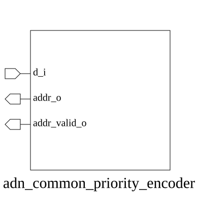

# adn_common_priority_encoder (module)

### Author : Shykul Islam Siam (shykulislam32@gmail.com)

## TOP IO

## Parameters
|Name|Type|Dimension|Default Value|Description|
|-|-|-|-|-|
|NUM_WIRE|int||4| Number of input wires; must be at least two.|
|HIGH_INDEX_PRIORITY|bit||0| When set, the highest asserted input has priority.|

## Ports
|Name|Direction|Type|Dimension|Description|
|-|-|-|-|-|
|d_i|input|logic [NUM_WIRE-1:0]|| Input vector to be encoded|
|addr_o|output|logic [$clog2(NUM_WIRE)-1:0]|| Binary encoded address of the highest/lowest priority bit|
|addr_valid_o|output|logic|| Validity flag: high if at least one bit in d_i is set|
## Description

### Purpose
This module implements a parameterized priority encoder that identifies the index of the first asserted bit in an input vector. It supports both low-index and high-index priority schemes, providing the binary address of the selected bit and a validity flag indicating if any input is active.

### Use-Case
This module is primarily used in arbitration logic, interrupt controllers, and resource allocation units where multiple requests arrive simultaneously, and a deterministic selection based on priority is required. By parameterizing the priority direction, it can be seamlessly integrated into both round-robin schedulers and fixed-priority bus masters.

| REVISION | DATE       | AUTHOR             | DESCRIPTION      |
|----------|------------|--------------------|------------------|
| 0.1      | 2026-07-30 | Shykul Islam Siam  | Initial version  |
| 1.0      | 2026-07-30 | Shykul Islam Siam  | Stable release   |
| 1.1      | 2026-08-01 | Foez Ahmed         | Simplified logic |
| 1.2      | 2026-08-01 | Foez Ahmed         | Ratified         |

This file is part of ADN-VLSI/adn_common
 **Copyright (c) 2026 ADN Semiconductors**
 **Licensed under the MIT License**
 **See LICENSE file in the project root for full license information**

