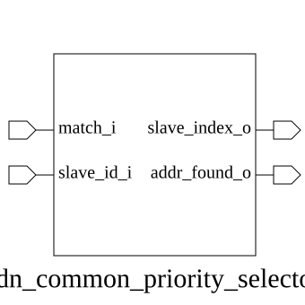

# adn_common_priority_selector (module)

### Author : Adnan Sami Anirban (adnananirban259@gmail.com)

## TOP IO

## Parameters
|Name|Type|Dimension|Default Value|Description|
|-|-|-|-|-|
|NUM_RULES|int||4|Number of input rules to evaluate|
|SLAVE_ID_WIDTH|int||4|Bit-width of the slave ID output|

## Ports
|Name|Direction|Type|Dimension|Description|
|-|-|-|-|-|
|match_i|input|logic [NUM_RULES-1:0]||Vector of match signals per rule|
|slave_id_i|input|logic [SLAVE_ID_WIDTH-1:0]|[0:NUM_RULES-1]|Array of slave IDs mapped to each rule|
|slave_index_o|output|logic [SLAVE_ID_WIDTH-1:0]||Selected slave ID based on priority|
|addr_found_o|output|logic||High if at least one match is found|
## Description

### Purpose
The `adn_common_priority_selector` module implements a priority-based selection logic that identifies the first active match from a set of input rules. It maps the highest-priority matching rule to a corresponding slave identifier and provides a status signal indicating whether a valid match was found.

### Usage
To use this module, instantiate it by specifying the `NUM_RULES` (number of input match signals) and `SLAVE_ID_WIDTH` (bit-width of the slave identifiers). Connect the `match_i` vector where each bit represents a rule status, and provide the `slave_id_i` array containing the IDs associated with each rule. The module will output the `slave_index_o` corresponding to the highest-priority (lowest index) active bit in `match_i`, and assert `addr_found_o` if any match is detected.

| REVISION | DATE       | AUTHOR          | DESCRIPTION                                            |
|----------|------------|-----------------|--------------------------------------------------------|
| 1.0      | 2026-07-30 | Adnan Sami Anirban | Stable release                                      |

This file is part of ADN-VLSI/adn_common
 **Copyright (c) 2026 ADN Semiconductors**
 **Licensed under the MIT License**
 **See LICENSE file in the project root for full license information**

