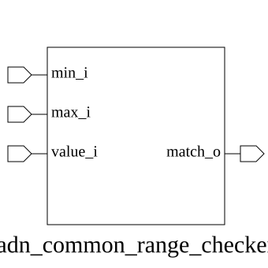

# adn_common_range_checker (module)

### Author: Adnan Sami Anirban (adnananirban259@gmail.com)

### Source: adn_common_address_range_compare.sv

## Top IO

## Parameters

|Name|Type|Dimension|Default|Description|
|-|-|-|-|-|
|WIDTH|int||32||

## Ports

|Name|Direction|Type|Dimension|Description|
|-|-|-|-|-|
|min_i|input|logic [WIDTH-1:0]|||
|max_i|input|logic [WIDTH-1:0]|||
|value_i|input|logic [WIDTH-1:0]|||
|match_o|output|logic|||

## Description

### Purpose
This module performs a range comparison to determine if a given address falls within a specified
inclusive-minimum and exclusive-maximum range. It is designed to be used in memory-mapped systems or
address decoding logic to validate address access.

### Usage
To use this module, instantiate it by specifying the `WIDTH` parameter to match your system's
address bus width. Connect the lower bound of the range to `min_i`, the upper bound (exclusive) to
`max_i`, and the address to be checked to `value_i`. The `match_o` output will assert high if
`min_i <= value_i < max_i`.

| REVISION | DATE       | AUTHOR             | DESCRIPTION                                         |
|----------|------------|--------------------|-----------------------------------------------------|
| 1.0      | 2026-07-30 | Adnan Sami Anirban | Stable release                                      |
| 1.1      | 2026-08-06 | Foez Ahmed         | Ratified                                            |

Author : Adnan Sami Anirban (adnananirban259@gmail.com)
