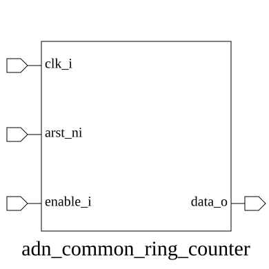
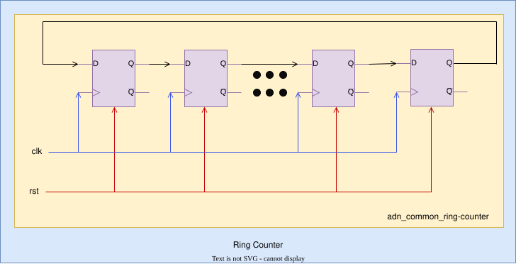

# adn_common_ring_counter (module)

### Author : Md. Sakib Hasan Shawon (mdsakibhasanshawon20@gmail.com)

## TOP IO




## Parameters
|Name|Type|Dimension|Default Value|Description|
|-|-|-|-|-|
|DATA_WIDTH|int||4| Parameter: DATA_WIDTH defines the number of bits in the ring counter|

## Ports
|Name|Direction|Type|Dimension|Description|
|-|-|-|-|-|
|clk|input|logic|| Input: System clock signal|
|rst_n|input|logic|| Input: Active-low synchronous reset signal|
|enable|input|logic|| Input: Enable signal to trigger the rotation of the bit|
|data|output|logic [DATA_WIDTH-1:0]|| Output: One-hot encoded vector representing the current state|
## Description


The `adn_common_ring_counter` module implements a synchronous one-hot ring counter. It rotates a single high bit through a register of a configurable width, providing a circular shift operation that is useful for state machine sequencing, token passing, or simple pulse generation.

### Usage

To use this module, instantiate it in your design and specify the `DATA_WIDTH` parameter to define the number of states in the ring.

```systemverilog
adn_common_ring_counter #(
    .DATA_WIDTH(8)
) u_ring_counter (
    .clk    (clk),
    .rst_n  (rst_n),
    .enable (enable),
    .data   (counter_out)
);
```

- **`clk`**: Connect to the system clock.
- **`rst_n`**: Connect to an active-low asynchronous or synchronous reset. Upon reset, the counter initializes to `100...0`.
- **`enable`**: When high, the counter shifts the high bit to the next position on the rising edge of the clock.
- **`data`**: The one-hot encoded output vector.

| REVISION | DATE       | AUTHOR          | DESCRIPTION                                            |
|----------|------------|-----------------|--------------------------------------------------------|
| 0.1      | 2026-07-30 | Md. Sakib Hasan Shawon | Initial version                                 |
| 1.0      | YYYY-MM-DD | Md. Sakib Hasan Shawon | Stable release                                  |

This file is part of ADN-VLSI/adn_common
<br>**Copyright (c) 2026 ADN Semiconductors**
<br>**Licensed under the MIT License**
<br>**See LICENSE file in the project root for full license information**

