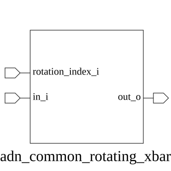

# adn_common_rotating_xbar (module)

### Author : Foez Ahmed (foez.official@gmail.com)

## TOP IO

## Parameters
|Name|Type|Dimension|Default Value|Description|
|-|-|-|-|-|
|DATA_WIDTH|||2| Width of each individual data port in bits|
|NUM_PORTS|||2| Total number of input and output ports in the crossbar|

## Ports
|Name|Direction|Type|Dimension|Description|
|-|-|-|-|-|
|in_i|input|logic [DATA_WIDTH-1:0]|[NUM_PORTS]| Array of input data buses|
|rotation_index_i|input|logic [$clog2(NUM_PORTS)-1:0]|| Control signal defining the cyclic shift offset|
|out_o|output|logic [DATA_WIDTH-1:0]|[NUM_PORTS]| Array of output data buses after cyclic permutation|
## Description

### Purpose
The `adn_common_rotating_xbar` module implements a circular crossbar (or barrel shifter) switch. It routes a set of input ports to a corresponding set of output ports based on a dynamic rotation index, effectively performing a cyclic shift of the input data bus array.

### Use Case
This module is primarily used in high-performance interconnects, packet switching fabrics, and round-robin arbitration logic where data streams need to be dynamically remapped to different processing elements or memory banks without the overhead of a full non-blocking crossbar. It is ideal for scenarios requiring low-latency cyclic permutations of data buses.

| REVISION | DATE       | AUTHOR          | DESCRIPTION                                            |
|----------|------------|-----------------|--------------------------------------------------------|
| 0.1      | 2026-08-01 | Foez Ahmed      | Initial version                                        |
| 1.0      | 2026-08-01 | Foez Ahmed      | Stable release                                         |

This file is part of ADN-VLSI/adn_common
 **Copyright (c) 2026 ADN Semiconductors**
 **Licensed under the MIT License**
 **See LICENSE file in the project root for full license information**

