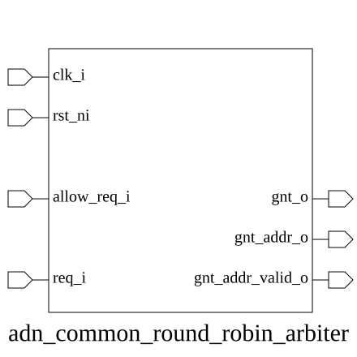

# adn_common_round_robin_arbiter (module)

### Author : Motasim Faiyaz (motasimfaiyaz@gmail.com)

## TOP IO

## Parameters
|Name|Type|Dimension|Default Value|Description|
|-|-|-|-|-|
|NUM_REQ|int||8| Number of request channels to arbitrate|

## Ports
|Name|Direction|Type|Dimension|Description|
|-|-|-|-|-|
|clk_i|input|logic|| Clock input|
|arst_ni|input|logic|| Active-low asynchronous reset|
|allow_req_i|input|logic|| High when the arbiter is permitted to grant a new request|
|req_i|input|logic [NUM_REQ-1:0]|| High when the arbiter is permitted to grant a new request|
|gnt_addr_valid_o|output|logic|| High when gnt_addr_o contains a valid grant|
|gnt_addr_o|output|logic [$clog2(NUM_REQ)-1:0]|| Encoded grant address, original order|
|gnt_o|output|logic [ NUM_REQ-1:0]|| One-hot grant output, original bit order|
## Description

# Purpose
The `adn_common_round_robin_arbiter` module implements a fair, round-robin arbitration scheme to select a single requester from multiple input requests. It ensures that every requester is granted access in a rotating order, preventing starvation and ensuring equitable bandwidth distribution among all input channels.

### Use Case
This module is primarily used in high-performance interconnects, such as:
- **Network-on-Chip (NoC) Routers:** To manage multiple input ports competing for a single output virtual channel.
- **Memory Controllers:** To arbitrate between multiple masters (e.g., CPU, DMA, GPU) requesting access to a shared memory interface.
- **Bus Interconnects:** To ensure fair access to shared peripheral buses where no single master should monopolize the bus bandwidth.

| REVISION | DATE       | AUTHOR          | DESCRIPTION                                            |
|----------|------------|-----------------|--------------------------------------------------------|
| 0.1      | 2026-07-28 | Motasim Faiyaz  | Initial version                                        |
| 1.0      | 2026-07-28 | Motasim Faiyaz  | Stable release                                         |
| 1.1      | 2026-08-01 | Foez Ahmed      | Simplified Logic                                       |
| 1.2      | 2026-08-01 | Foez Ahmed      | Ratified                                               |

This file is part of ADN-VLSI/adn_common
 **Copyright (c) 2026 ADN Semiconductors**
 **Licensed under the MIT License**
 **See LICENSE file in the project root for full license information**

