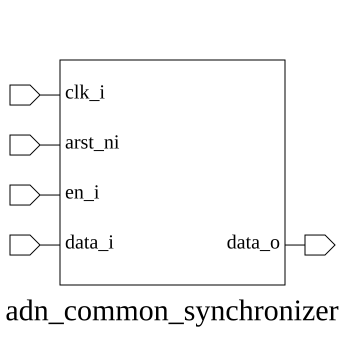

# adn_common_synchronizer (module)

### Author : Ahasan Ullah Khalid (aukhalid02@gmail.com)

## TOP IO

## Parameters
|Name|Type|Dimension|Default Value|Description|
|-|-|-|-|-|
|WIDTH|int||1|Width of the data bus to be synchronized|
|STAGES|int||2|Number of flip-flop stages for metastability reduction|
|RESET_VALUE|logic [WIDTH-1:0]||'0|Value of the synchronizer registers during reset|

## Ports
|Name|Direction|Type|Dimension|Description|
|-|-|-|-|-|
|clk_i|input|logic||Clock signal for the destination domain|
|rst_n_i|input|logic||Active-low asynchronous reset|
|data_i|input|logic [WIDTH-1:0]||Asynchronous input data|
|data_o|input|logic [WIDTH-1:0]||Synchronized output data|
## Description

### Purpose
The `adn_common_synchronizer` module is a parameterized multi-stage flip-flop chain designed to synchronize asynchronous input signals to a target clock domain. It helps mitigate metastability issues when transferring data between different clock domains or from asynchronous sources.

@foez---bhai, describe the usage of this module in markdown format here. This is already in multi-line comment, so don't add any additional comment syntax.

| REVISION | DATE       | AUTHOR              | DESCRIPTION                                            |
|----------|------------|---------------------|--------------------------------------------------------|
| 0.1      | 2026-07-28 | Ahasan Ullah Khalid | Initial version                                        |
| 1.0      | 2026-07-28 | Ahasan Ullah Khalid | Stable release                                         |

This file is part of ADN-VLSI/adn_common
 **Copyright (c) 2026 ADN Semiconductors**
 **Licensed under the MIT License**
 **See LICENSE file in the project root for full license information**

