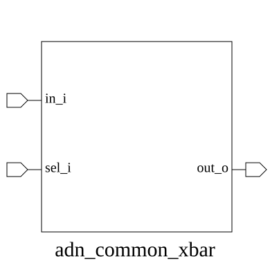

# adn_common_xbar (module)

### Author: Foez Ahmed (foez.official@gmail.com)

### Source: adn_common_xbar.sv

## Top IO

## Parameters

|Name|Type|Dimension|Default|Description|
|-|-|-|-|-|
|DATA_WIDTH|int||2|Width of the data bus in bits|
|NUM_INPUTS|int||2|Number of input ports|
|NUM_OUTPUTS|int||2|Number of output ports|

## Ports

|Name|Direction|Type|Dimension|Description|
|-|-|-|-|-|
|sel_i|input|logic [NUM_OUTPUTS-1:0][$clog2(NUM_INPUTS)-1:0]||Selection signals for each output port (index of input to route)|
|in_i|input|logic [NUM_INPUTS-1:0][DATA_WIDTH-1:0]||Input data ports array|
|out_o|output|logic [NUM_OUTPUTS-1:0][DATA_WIDTH-1:0]||Output data ports array|

## Description

### Purpose
This module implements a generic crossbar switch (xbar) that routes data from multiple input ports to multiple output ports based on provided selection signals. It supports configurable data widths and input/output counts, providing a flexible interconnect solution for data path routing.

### Use Case
The `adn_common_xbar` is designed for high-performance interconnect fabrics where multiple data sources must be dynamically routed to specific destinations. Common use cases include:
- **Memory Interconnects:** Routing data from multiple cache controllers to shared memory banks.
- **NoC (Network-on-Chip) Routers:** Serving as the primary switching fabric within a router node.
- **Peripheral Bus Switching:** Connecting multiple master peripherals to various slave interfaces in a SoC.
- **Data Path Multiplexing:** Efficiently selecting data streams in DSP or signal processing pipelines to reduce logic overhead.

| REVISION | DATE       | AUTHOR          | DESCRIPTION                                            |
|----------|------------|-----------------|--------------------------------------------------------|
| 0.1      | 2026-08-01 | Foez Ahmed      | Initial version                                        |
| 1.0      | 2026-08-01 | Foez Ahmed      | Stable release                                         |
| 1.1      | 2026-08-01 | Foez Ahmed      | Ratified                                               |

Author : Foez Ahmed (foez.official@gmail.com)
