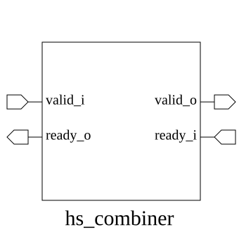

# hs_combiner (module)

### Author : Foez Ahmed (foez.official@gmail.com)

## TOP IO

## Parameters
|Name|Type|Dimension|Default Value|Description|
|-|-|-|-|-|
|NUM_TX|int||2||
|NUM_RX|int||2||

## Ports
|Name|Direction|Type|Dimension|Description|
|-|-|-|-|-|
|valid_i|input|logic [NUM_TX-1:0]|||
|ready_o|output|logic [NUM_TX-1:0]|||
|valid_o|output|logic [NUM_RX-1:0]|||
|ready_i|input|logic [NUM_RX-1:0]|||
## Description

# Handshake Combiner Module

The hs_combiner module is designed to aggregate multiple handshake-based interfaces into a unified flow. It manages the synchronization and flow control signals between a set of transmitter (TX) ports and receiver (RX) ports, ensuring that data transfers are correctly arbitrated and acknowledged according to the handshake protocol.

## Usage
To use the `hs_combiner` module, instantiate it in your design by specifying the `NUM_TX` and `NUM_RX` parameters to match your interface requirements. Connect the `valid_i` and `ready_o` ports to your transmitter logic, and the `valid_o` and `ready_i` ports to your receiver logic. The module will automatically handle the handshake arbitration, asserting `ready_o` when the corresponding receiver is ready and propagating `valid_i` to the appropriate `valid_o` output based on the internal routing logic.

| REVISION | DATE       | AUTHOR          | DESCRIPTION                                            |
|----------|------------|-----------------|--------------------------------------------------------|
| 1.0      | 2026-07-22 | Foez Ahmed      | Stable release                                         |

This file is part of ADN-VLSI/adn_common
 **Copyright (c) 2026 ADN Semiconductors**
 **Licensed under the MIT License**
 **See LICENSE file in the project root for full license information**
