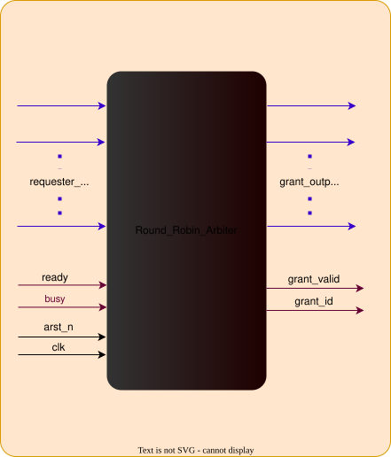

# r_robin_arbiter (module)

### Author : Foez Ahmed (foez.official@gmail.com)

## TOP IO

## Parameters
|Name|Type|Dimension|Default Value|Description|
|-|-|-|-|-|
|N|int||4|Number of requesters to arbitrate|

## Ports
|Name|Direction|Type|Dimension|Description|
|-|-|-|-|-|
|arst_n|input|logic||Active-low asynchronous reset|
|clk|input|logic||Rising-edge clock|
|req_i|input|logic [N-1:0]||Request vector from N requesters|
|grant_o|output|logic [N-1:0]||One-hot grant vector; exactly one requester is selected at a time|

## Description

### Purpose
The `r_robin_arbiter` module implements a parameterized, robust round-robin arbiter for `N` requesters. It provides fair arbitration over a shared resource by rotating priority after each successful grant.

### Core Features
|Feature|Behavior|
|-|-|
|Number of requesters|Parameterizable via `N`|
|Grant timing|Immediate combinational grant selection|
|Pointer update|Only advances after a successful grant|
|No requests|Pointer is preserved|
|Multiple requests|Exactly one requester is granted|
|Persistent requests|Supported; a continuously asserted request can be served again on a later round|
|Reset behavior|Internal pointer is initialized to `0`|

### Arbitration Algorithm
1. On reset, the internal round-robin pointer is set to `0`.
2. Each cycle, the arbiter scans the request vector starting from the current pointer.
3. If a requester is asserted at or after the pointer, the first match is granted.
4. If no requester is found in that range, the search wraps around and continues from the beginning.
5. The pointer is advanced only when a grant is issued; otherwise the current pointer is held.

This approach provides fair service to all requesters while preventing starvation for continuously active requests.

### Usage
Instantiate the arbiter between multiple requesters and a shared resource. Connect each requester's request bit to the corresponding position in `req_i`, then monitor `grant_o` to identify the selected requester.

The one-hot grant vector makes it easy to decode the winner, for example by locating the asserted bit in `grant_o`.

| REVISION | DATE       | AUTHOR          | DESCRIPTION                                            |
|----------|------------|-----------------|--------------------------------------------------------|
| 1.0      | 2026-07-27 | Foez Ahmed      | Initial documentation draft for round-robin arbiter    |

 **This file is part of https://github.com/ADN-VLSI/adn_common**
 **Copyright (c) 2026 ADN Semiconductors**
 **Licensed under the MIT License**
 **See LICENSE file in the project root for full license information**
